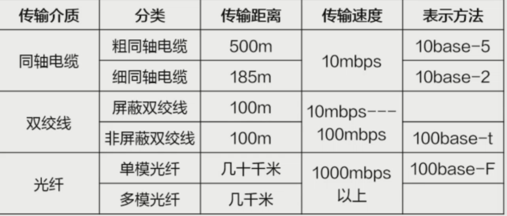

# 计算机理论

## 关系数据库理论

有点杂不太有时间总结，我觉得重点应该是三级模式，E-R图，约束，数据库、数据库技术，数据库系统、数据库管理系统的基础概念，安全性等基础知识，sql语句

### 数据库、数据库技术，数据库系统、数据库管理系统的概念：数据库系统的体系结构

1. 数据库、数据库技术、数据库系统、数据库管理系统的概念
   1. 数据：描述事物的符号记录，包括数据的表现形式和数据解释两个部分。如数字、音频、图形、文本、图像、语言、视频等多种表现形式。经过数字化处理后存入计算机。数据是信息的符号表示或载体。信息是数据的内涵是对数据的语义解释。
   2. 数据库（DB）：长期存储在计算机内、有组织、可共享的大量数据的集合。数据库中的数据按照一定的数据模型组织、描述和存储，具有娇小的冗余度、交稿的数据独立性和易扩展性，并可为各种用户共享。
   3. 数据库管理系统（DBMS）：位于用户和操作系统间的数据管理系统的一层数据管理软件。用途：科学地组织和存储数据，高效地 获取和维护数据。包括数据定义功能，数据组织、存储和管理，数据库的事物管理和运行管理，数据库的建立和维护功能，其他功能。
   4. 数据库系统（DBS）：在计算机系统中引入数据库后的系统，一般由数据库。数据库管理系统（及其开发工具）、应用系统、数据库管理员构成。目的：存储信息并支持用户检索和更新所需的信息
2. 数据库系统的体系结构

- 应用程序层
- 查询处理器
- 事物管理器
- 并发控制器
- 备份和恢复管理器
- 安全性管理器

### 数据模型与数据视图

1. 数据模型：是数据库中用来对现实世界数据特征的抽象的工具，是数据库中用于提供信息表示和操作手段的形式架构。
   - 数据结构：是所研究的对象类型的集合，是对系统静态特性的描述。
   - 数据操作：对数据库中各种对象（型）的实例（值）所允许进行的操作的集合， 包括操作及有关的操作规则，是对系统动态特性的描述
   - 数据的约束条件：是完整性规则的集合。完整性规则是给订的数据库模型中数据及其联系所具有的制约和依存规则，用一限定符合数据模型的数据库状态及其变化，以保证数据库的正确、有效、相容。
2. 数据视图：数据视图是从数据库中抽取出来的虚拟表或子集，它根据用户或应用程序的需求，以特定的方式呈现数据，提供了一个定制化的数据访问接口。

### 关系代数，关系演算及关系模型

### 结构化查询语言SQL

### 数据库的完整性与安全性，事务管理、并发控制、故障恢复，数据库的备份与恢复

### 数据库的设计，数据依赖的概念及关系模式的规范化理论

### 数据库应用开发工具，常见数据库系统产品的名称、特点，Microsoft SQL Server数据库的使用

## 网络技术基础

### 计算机网络的基本概念；计算机网络的功能、应用、拓扑结构及分类；网络的层次体系结构和网络协议；网络标准化

> 三网合一：“电信网络” “有线电视网络” “计算机网络”

1. 基本概念：计算机网络是指分布在不同地理位置上的具有独立功能的多个计算机系统，通过通信设备和通信线路互连起来，在网络软件的管理下实现数据传输和资源共享的系统
2. 网络的功能
   - 数据通信
   - 资源共享：最本质的功能
   - 提高性能：网络中的计算机都可通过网络相互成为后备机
   - 分布式处理：快速地进行处理，负载均衡
3. 网络的分类
   - 按网络的分布范围分类:广域网 WAN、局域网 LAN、城域网 M
     - 局域网(LAN)：局域网是指在某一区域内由多台计算机互联成的计算机组。
     - 城域网(MAN)：城域网是在一个城市范围内所建立的计算机通信网，简称MAN。
     - 广域网(WAN)：广域网也称远程网，通常跨接很大的物理范围。
   - 按网络的交换方式分类:电路交换、报文交换、分组交换
   - 按网络的拓扑结构分类:星形、总线、环形、树形、网形
   - 按网络的传输媒体分类:双绞线、同轴电缆、光纤、无线
   - 按网络的信道分类:窄带、宽带
   - 按网络的用途分类:教育、科研、商业、企业
4. 网络的应用：互联网；局域网和广域网；电子邮件；文件共享；远程访问；即时通讯；在线娱乐；电子商务；远程教育；物联网
   - 办公自动化 OA(Office Automation)
   - 电子数据交换 EDI(Electronic Data Interc
   - 远程交换(Telecommuting)
   - 远程教育(Distance Education)
   - 电子银行
   - 电子公告板系统 BBS(Bulletin Board System)
   - 证券及期货交易
   - 广播分组交换
   - 校园网(Campus Network)
   - 信息高速公路
   - 企业网
   - 智能大厦和结构化综合布线系统
5. 拓扑结构及分类
   - 星型：星形拓扑结构是一种以中央节点为中心，把若干外围节点连接起来的辐射式互联结构，各结点与中央结点通过点与点方式连接，中央结点执行集中式通信控制策略，因此中央结点相当复杂，负担也重。
   - 树型：树形拓扑结构是一种层次结构，结点按层次连结，信息交换主要在上下结点之间进行，相邻结点或同层结点之间一般不进行数据交换。
   - 总线型拓扑结构：总线型拓扑是采用单根传输作为共用的传输个质，将网络中所有的计算机通过相应的硬件接口和电缆直接连接到这根共享的总线上。使用总线型拓扑结构需解决的是确保端用户使用媒体发送数据时不能出现冲突。
   - 环型拓扑结构：环型拓扑是使用公共电缆组成一个封闭的环，各节点直接连到环上，信息沿着环按一定方向从一个节点传送到另一个节点。在环型拓扑结构中，有一个控制发送数据权力的“令牌”。
   - 网状拓扑结构：网状拓扑结构，这种拓扑结构主要指各节点通过传输线互联连接起来，并且每一个节点至少与其他两个节点相连，网状拓扑结构具有较高的可靠性，但其结构复杂，实现起来费用较高，不易管理和维护，不常用于局域网。
6. 网络的层级体系结构
   - OSI七层协议：物数网传会表应；不同主机之间的相同层次称为对等层
     - 物理层：规定了激活、维持、关闭通信端点之间的机械特性、电气特性、功能特性以及过程特性。该层为上层协议提供了一个传输数据的物理媒体。 
       在这一层，数据的单位称为帧(frame)。
     - 数据链路层：不可靠的物理介质上提供可靠的传输。该层的作用包括：物理地址寻址、数据的成帧、流量控制、数据的检错、重发等 
       数据链路层协议的代表包括：SDLC、HDLC、PPP、STP、帧中继等。
     - 网络层：负责对子网间的数据包进行路由选择。此外，网络层还可以实现拥塞控制、网际互连等功能。在这一层，数据的单位称为数据包(packet) 
       网络层协议的代表包括：IP、IPX、RIP、OSPF等。
     - 传输层：是一个端到端，即主机到主机的层次。传输层负责将上层数据分段并提供端到端的、可靠的或不可靠的传输。此外，传输层还要处理端到端的差错控制和流量控制问题。在这一层，数据的单位称为数据段(segment) 
       传输层协议的代表包括：TCP、UDP、SPX等。
     - 会话层：管理主机之间的会话进程，即负责建立、管理、终止进程之间的会话 
       会话层还利用在数据中插入校验点来实现数据的同步。 
       会话层协议的代表包括：NetBIOS、ZIP(AppleTalk区域信息协议)等。
     - 表示层：对上层数据或信息进行变换以保证一个主机应用层信息可以被另一个主机的应用程序理解。表示层的数据转换包括数据的加密、压缩、格式转换等 
       表示层协议的代表包括：ASCl、ASN.1、JPEG、MPEG等。
     - 应用层：为操作系统或网络应用程序提供访问网络服务的接口 
       应用层协议的代表包括：Telnet、FTP、HTTP、SNMP等。
   - TCP协议
     - 应用层：HTTP、FTP、TPTP、SMTP、POP、DNS
     - 传输层：TCP、UDP
     - 网络层：ICMP、IGMP、IP、ARP、RARP
     - 网路接口层：数据链路层 + 物理层
7. 网络协议：为进行网络中的数据交换而建立的规则、标准或约定
   - 语法：数据与控制信息的结构或格式
   - 语义：需要发出何种控制信息，完成何种动作以及做出何种响应
   - 同步：事件实现顺序的详细说明
8. 网络标准化：协议标准；数据格式标准；安全标准；硬件接口标准；应用程序接口标准
   - 国际标准化组织(ISO)
   - 国际电报电话咨询委员会(CCITT)
   - 美国国家标准局(NBS)
   - 美国国家标准学会(ANSI)
   - 欧洲计算机制造商协会(ECMA)
9. 发展
   - 1969年世界上第一个ARPANET网络(阿帕网)
   - 1985年：三级结构网络阶段，分为，主干网、地区网和校园网(企业网)
   - 多层级的ISP结构的internet，ISP负责分配ip地址
10. 组成
    - 边缘部分：资源子网，由所有连接在因特网上的主机组成。这部分是用户直接使用的，用来进行通信(传送数据、音频或视频)和资源共享
    - 核心部分：通信子网，由大量网络和连接这些网络的路由器组成。这部分是为边缘部分提供服务的(提供连通性和交换)
11. 性能指标
    - 速率 b/s kb/s Mb/s Gb/s
    - 带宽 “带宽”本来是指信号具有的频带宽度，单位是赫(或干赫、兆赫、吉赫等)。最高频率和最低频率的差值。现在“带宽”是数字信道所能传送的“最高数据率”的同义语，单位是“比特每秒”，或b/s(bit/s)。
    - 吞吐量：在单位时间内通过某个网络的数据量
    - 时延
      - 发送时延：第一个比特算起，到最后一个比特发送完毕所需的时间。
      - 传播时延：电磁波在信道中需要传播一定的距离而花费的时间。
      - 处理时延：交换结点为存储转发而进行一些必要的处理所花费的时间
      - 排队时延：结点缓存队列中分组排队所经历的时延。
      - 总时延=发送时延+传播时延+处理时延+排队时延
    - 时延带宽积：传播时延 \* 带宽
    - 利用率：信道利用率指出某信道有百分之几的时间是被利用的（有数据通过）。完全空闲的信道的利用率是零。

### 物理层，数据通信的理论基础，物理传输媒体、编码与传输技术及传输系统

1. 数据通信技术
   - 基础
     - 机械特性：指明接口所用接线器的形状和尺寸、引线数目和排列、固定和锁定装置等等。
     - 电气特性：指明在接口电缆的各条线上出现的电压的范围。
     - 功能特性：指明某条线上出现的某一电平的电压表示何种意义。
     - 过程特性：指明对于不同功能的各种可能事件的出现顺序。
   - 信号编码
     - 把二进制代码转化为计算机信号的过程，称为编码技术。
     - 常见的编码技术有：单极性码、极性码、双极性码、归零码、不归零码、双相码、曼彻斯特码、差分曼彻斯特码等。常见的编码技术是：曼彻斯特码和差分曼彻斯特码编码。
   - 通信方式
     - 单向通信（单工通信）：只能有一个方向的通信而没有反方向的交互。
     - 双向交替通信（半双工通信）：通信的双方都可以发送信息，但不能双方同时发送（当然也就不能同时接收）。
     - 双向同时通信（全双工通信）：通信的双方可以同时发送和接收信息。
     - 基带信号（即基本频带信号）来自信源的信号，数字信号。
     - 频带信号：频带传输是在计算机网络系统的远程通信中把数字信息调制成模拟音频信号后再发送和传输，到达接收端时再把音频信号解调成原来的数字信号的传输技术。
2. 物理传输媒体、编码与传输技术
   - 概念
     - 波特率(baud rate)：指每秒传输的码元数，单位为波特，说明单位时间传输了多少个码元。。若每个码元所含的信息量为比特，则波特率等于比特率。所以特率通常单位是bit/s,也就是二进制位/秒。 
       例如：3600的波特率的信道，理论上每秒可以传输3600/8个字节的数据，也就是450个字节。
     - 比特率(bit rate)：每秒钟传输数据的位数，即bt/S,或写成位每秒。基本上用于表示网络传输速度，有时候也可以写成bps(参照第一节的计算机网络性能指标)。
     - 带宽(bandwidth)网络信道中所能容纳信号的宽度，即信号的频率范围(参照第一节的计算机网络性能指标)。
     - 码元：在数字通信中常常用时间间隔相同的符号来表示数字。这样的时间间隔内的信号称为码元，这个间隔称为码元长度。 
       例如：如果在数字传输过程中，0V、2V、4V和6V分别表示00、01、10和11，那么每个码元有四种状态00、01、10和11。每个码元代表两个二进制数字。此时的每秒码元数是每秒二进制代码数是一半的，这叫四相调制，波特率等于比特率一半。
   - 奈奎斯特定理(奈氏准则)：对于一个带宽为W赫兹的理想信道，其最大码元（信号）速率为2W波特。这一限制是由于存在码间干扰。如果被传输的信号包含了M个状态值（信号的状态数是M）,那么W赫兹信道所能承载的最大数据传输速率（信道容量）是：2 _ W _ log₂W
   - 信噪比
     - 信号衰减：信号的传输的波形，在信号的传输过程中受到（带宽、噪声、干扰、距离、磁场、电场）等影响。 
       码元传输的速度越高，或信号传输的距离远，或噪声干扰越大，或传输媒体质量越差，在接收端的波形是真就越严重。
     - 噪音：是指信息经过该设备后产生的原信号中并不存在的无规则的额外信号（或信息），并且该种信号并不随原信号的变化而变化。噪声是无规律的。
     - 信噪比：信息传输过程中，信号的平均功率和噪声的平均功率的比，常用S/N,分贝(dB)是度量单位。信噪比(dB)=l0 \* lg(s/N) 
       信噪比越小说明信号越好
     - 香弄定理：C = W \* log₂(1 + S/N)²b/s
   - 信道的复用技术
     - 信号频段
     - 频分多路复用(FDM)：是指载波带宽被划分为多种不同频带的子信道每个子信道可以并行传送一路信号的一种多路复用技术。用户在分配到一定的频带后，在通信过程中自始至终都占用这个频带。频分复用的所有用户在同样的时间占用不同的带宽资源。
     - 时分多路复用(TDM)
       - 基本概念：按传输信号的时间进行分割的，它使不同的信号在不同的时间内传送，将整个传输时间分为许多时间间隔(时隙)，每个时间片被一路信号占用。TDM就是通过在时间上交叉发送每一路信号的一部分来实现一条电路传送多路信号的。
       - 特点：每一个用户所占用的时隙是周期性地出现（其周期就是TDM帧的长度）。
     - 统计时分多路复用(STDM)：动态地按需分配共用信道的时隙，只将需要传送数据的终端接入共用信道，以提高信道利用率的多路复用技术，简称STDM。也称异步时分多路复用。在进行数据传输时，可以先统计下一时刻需要发送数据的用户数量，这样可以把当前的一个TDM周期分割成等时的积分，分给不同的用户使用，在不同的周期分割的时间不同，这样不同的用户就可以在不同的周期占用信道的时间就会有不同。
     - 波分多路复用(SWDM)：两种或多种不同波长的光载波信号（携带各种信息）在发送端经复用器(S亦称合波器，Multiplexer)汇合在一起，并耦合到光线路的同一根光纤中进行传输的技术。 
       波分复用就是光的频分复用。
   - 传输介质⭐
     - 同轴电缆
       - 细缆：直径为0.26厘米，最大传输距离185米，使用时与50 终端电阻、T型连接器。网络最大的干线长度：大于185米，小于500米。
       - 粗缆：直径为1.27厘米，最大传输距离达到500米。网络干线电缆长度：大于925米，小于2500米。
     - 双绞线：最常用的传输介质
       - 屏蔽
       - 非屏蔽
     - 光纤：用的光的全反射原理
       - 单模光纤
       - 多模光纤
     - 无线传输
       - 短波
       - 微波
       - 卫星
     - 重点在表示方法 ⭐ 
3. 传输设备及技术

- 中继器：对接收信号进行再生和发送
- 集线器：多端口的中继器，不具备MAC地址表，采用广播方式发送，采用CSMA/CD(载波帧听多路访问/冲突检测)协议去处理发送冲突
- ADSL技术就是用数字技术对现有的模拟电话用户线进行改造，使它能够承载宽带业务。标准模拟电话信号的频带被限制在300~3400Hz的范围内，但用户线本身实际可通过的信号频率仍然超过1MHZ。ADSL技术就把0~4kHz低端频谱留给传统电话使用，而把原来没有被利用的高端频谱留给用户上网使用。DSL就是数字用户线(Digital Subscriber Line)的缩写
- HFC：光纤同轴混合网HFC(Hybrid Fiber Coax)HFC网是在目前覆盖面很广的有线电视网CATV的基础上开发的一种居民宽带接入网。 
  HFC网除可传送CATV外，还提供电话、数据和其他宽带交互型业务。br/>
  现有的CATV网是树形拓扑结构的同轴电缆网络，它采用模拟技术的频分复用对电视节目进行单向传输。而HFC网则需要对CATV网进行改造。
- FTTx技术：FTTX(光纤到…)也是一种实现宽带居民接入网的方案。这里字母X，可代表不同意思。例如：

### 数据链路层，差错检测与校正，数据链路层协议

1. 作用
   - 主要是在数据通信前，在物理线路上进行数据链路连接的建立、拆除、分离工作。
   - 为网络层提供服务：数据链路层位于物理层和网络层中间，所以数据链路层是享用物理层的服务和向网络层提供服务。物理层传输数据是不可靠的，数据链路层必须保证数据传输的可靠性和准确性。
   - 封装成帧：封装成帧也就是帧的定界，是在一段数据的前后分别添加首部和尾部，然后就构成了一个帧。告知接收方帧的开始位置和结束位置，确定帧中数据的位置。在封装成帧时，不考虑帧的长短等问题。
   - 差错检测：保证数据的可靠传输，则必须对数据进行相应的校验机制，保证接收到的数据是可靠的，有效的，正确的。 
     误码率：传输错误的比特占所传输比特总数的比率称为误码率。误码率与信噪比有很大的关系。误码率越大，计算机网络性能越差。如果数据链路层接收的帧出现错误或这帧的长度有变化，则数据链路层就直接丢弃当前接收的数据帧。
     - 向后纠错：接收端发现接收的数据帧出现错误时，以某种方式通知发送端重传该数据帧，直到接收到正确的数据帧为止。
     - 向前纠错：接收端不能发现接收的数据帧的错误，而能确定二进制代码中发生错误的位置，从而进行纠正，允许接收方修改数据。
   - 流量控制：控制数据发送的速度，保证发送的帧不要太长，以免造成网络拥塞或这接收方不能完全接收。
     - 基于反馈的流量控制，根据接收方反馈的信息来控制发送的数据；
     - 基于速率的流量控制，加法增大和乘法减小等原则。
       常用的流量控制方法是：滑动窗口协议。
   - MAC寻址：根据计算机网卡的物理地址，在局域网中寻找网络主机的地址，把数据发送给目标地址，一帮局域网中寻址方式是MAC寻址，页脚物理寻址。
   - 透明传输：保证帧的传输信息和控制信息不能混淆，接收方能区分正常数据和控制信息等数据，例如帧开始控制信息和结束控制信息。
2. 数据帧透明传输
   - 字节计数法：在开始字段后添加一个帧的长度确定帧中传输数据的长度
   - 特殊字符填充的首尾定界方法：SOH EOT，转义解决内部有的问题在前面插入ESC
   - 特殊比特填充的首尾标志方法：01111110，在连续五个1的时候在后面加一个0，接收方给去掉
   - 违例编码法：用错误的定义开始和结束
3. 差错控制：出错原因0，1出错
4. 检错编码
   - 水平/垂直奇偶校验
   - 循环冗余校验CRC
5. 纠错编码
   - 水平垂直奇|偶校验
   - 海明校验：只要增加少数几个校验位，就能检测出二位同时出错，原理，是在k个数据位之外加上r个校验位，从而形成k+r位的新的码
6. 设备
   - 硬件地址：48位全球地址、难记住所以改为16进制的地址；只要不换网卡，mac地址就不变
   - 网络适配器：网络接口卡NIC又称网络接口卡或网络适配器。网卡是工作在链路层的网络组件，是局域网中连接计算机和传输介质的接口，不仅能实现与局域网传输介质之间的物理连接和电信号匹配，还涉及帧的发送与接收、帧的封装与拆封、介质访问控制、数据的编码与解码以及数据缓存的功能等。
   - 网桥：网桥也叫桥接器，是连接两个相同协议的局域网设备。也可以用于连接大的局域网中同的网段。
7. 协议：SDLC、HDLC、PPP、STP、帧中继等

### 局域网，多路访问协议及IEEE802局域网标准族

1. 多路访问协议：CSMA/CD、CSMA/CA、令牌传递
   - 载波多路访问（Carrier Sense Multiple Access，CSMA）：CSMA是一种基本的多路访问协议，它要求设备在发送数据之前先监听信道，如果信道空闲，则发送数据；如果信道忙碌，则等待一段随机时间后再次尝试发送。IEEE 802.3以太网使用CSMA/CD（载波监听多路访问/碰撞检测）协议，用于有线局域网。
   - 无线局域网多路访问协议（Wireless LAN Multiple Access Protocols）：IEEE 802.11标准定义了无线局域网技术，包括多种多路访问协议，如基础CSMA/CA（载波监听多路访问/碰撞避免）和带时隙的CSMA/CA（DCF和PCF）等
   - 令牌传递（Token Passing）：令牌传递是一种基于令牌的多路访问协议，在局域网上设备通过传递一个特殊的令牌来控制访问权。IEEE 802.5标准定义了令牌环局域网技术，采用了令牌传递协议
2. IEEE802局域网标准族：IEEE 802局域网标准族中的一部分，它们定义了局域网上设备之间的通信规则和协议，促进了不同厂商的设备互联和互操作
   - IEEE 802.3 - 以太网：最常见的有线局域网技术，定义了基于CSMA/CD协议的以太网通信标准，包括以太网速率、帧格式、介质访问控制等。
   - IEEE 802.11 - 无线局域网：定义了Wi-Fi技术的一系列标准，包括不同频段下的物理层规范和多路访问协议（如CSMA/CA），以及安全性和QoS方面的扩展。
   - IEEE 802.1 - 网络体系结构：定义了局域网的体系结构和通用概念，包括虚拟局域网（VLAN）、网桥和交换机的操作规则等。
   - IEEE 802.15 - 无线个人区域网（WPAN）：包括蓝牙（IEEE 802.15.1）、低功耗蓝牙（IEEE 802.15.4）、Zigbee（IEEE 802.15.4）等短距离无线通信技术
   - IEEE 802.16 - 广域无线接入（WiMAX）：定义了用于宽带无线接入的技术标准，支持长距离覆盖和高速数据传输。
   - IEEE 802.22 - 空白电视频谱数据库管理：利用空白电视频谱进行无线宽带接入的技术标准，提供了一种利用未使用的电视频谱进行宽带接入的方法。
   - IEEE 802.21 - 媒体无缝性：定义了跨不同网络和技术之间的移动设备无缝切换的标准，使得移动设备可以在不同的网络之间平滑切换而无需中断连接。

### 网络层，数据交换方式，路由选择与拥塞控制算法，常见高速网络技术网络层协议

1. 作用
   - 两种服务
     1. 面向连接服务：可靠性好
     2. 无连接服务：速度快、可靠性不太好
   - 路由选择
   - 尽最大努力交付，对传输的数据不进行校验
2. 协议
   - 地址解析协议ARP：根据ip获取物理地址(MAC地址)
   - 逆地址解析协议RARP
   - internet制报协议ICMP
   - internet管理协议IGMP
3. IP协议
   - IPV4
     - 特点
       1. 唯一性：在Internet\_上的计算机所拥有的IP地址是不同的，即网络中不能有两台主机同时使用同一个P地址。如果使用会造成P地址冲突，使得后使用者不能使用P地址进行网路连接。
          一台计算机上可以设置多个P地址，但是使用的时候只能用其中的1个发送数据或作为计算机的唯一标识。
       2. 固定长度：32位二进制
       3. 可变性：当计算机所在的网络发生变化后，其ip地址也要跟着发生变化
       4. 点分十进制：把32位二进制平均分成4个字节，然后改写成十进制书写
       5. 组成：{<网络号>, <主机号>}
          - 网络号：表示计算机所在的网络，路由器在进行路由选择的时候使用
          - 主机号：表示网络中的某台主机，是计算机在某个网络中的唯一标识。网络号相同的计算机可以不经过路由器的转发就可以直接通信
     - 分类
     - 国际标准：根据第一个字节不同，分为ABCDE
       - A 1-126 大型网络
       - B 128-191 中型网络
       - C 192-223 小型网络
       - D 224-239
       - E 240-255
     - 公用ip
     - 私有ip
       - IPV6：将32位改为128位，唯一的缺点就是太长了不好记
         - 冒分十六进制表示法
         - 0位压缩表示法⭐：可以把连续的0压缩，但是只能有一个地方压缩
         - 兼容IPV4地址表示法
4. 子网掩码 ⭐
   用来指明IP地址的网络位和主机位，1是网络位，0是主机位。通过这个规则，就可以求出网络、主机号 
   比如192.172.123.125 子网掩码255.255.255.240的网络号 
   192.172.123.125 -> 192.172.123.01111101 
   255.255.255.255.240 -> 255.255.255.11110000 
   网络号：192.172.123.01110000 -> 192.172.123.112(16 + 32 + 64) 
   主机号: 1101 -> 13 
   广播号：192.172.123.01111111 -> 192.172.123.127 
   网络号和广播号是不可以分给用户的
5. 子网划分：用来节约ip地址，将大网络划分为小的网络，从主机位借位当网络位
6. 路由器
   - 概念：路由器是通信子网的核心设备，是连接因特网中各局域网、广域网的设备，根据信道的情况自动选择和设定路由，以最佳路径，按前后顺序发送信号
   - 概念
     - 网络连接：路由器支持各种局域网和广域网连接，广域网和广域网连接，实现不同网络互相通信，完成异构网络的互联功能。
     - 路由寻址：路由器根据路由表的对应信息，可以直接把数据报文传转发到下一个路由器，数据包经过国瓷路由转发后，就可以到达目的地。
     - 数据转发：路由器对进出路由内部的数据报文信息进行过滤，提供包括分组过滤、分组转发、优先级、复用、加密、压缩和防火墙等功能。
     - 网络管理：网络管理主要是对网络进行子网划分、拨号加密等功能。路由器还提供包括路由器配置管理、性能管理、容错管理和流量控制等功能。
     - 隔绝广播域：使得引P的广播报文限制在一个网段（或子网）中进行广播，这样的广播信号不会传输到其他的网络中，造成网络的拥塞和资源的浪费，能跟好的保证网络的安全性。
   - 协议
     - 静态路由： 以手工方式将路由添加到每台路由器的路由表中的方式就是静态路由。
       - 优点：对于路由器的CPU没有管理性开销。在路由器之间没有带宽占用，意味着在WAN链接中可以节省花费。增加了安全性，因为管理员可以有选择地允许路由只访问特定的网络。
       - 缺点：管理员必须真正了解所配置的互联网络，正确配置这些路由。网络发生变化的时候需要修改路由表，工作量大。对于大型网络来说，静态路由会导致巨大的工作量，不可行。
         添加默认路由的命令是：
         ip route 192.168.1.1 255.255.255.0 10.65.1.2
     - 动态路由：使用协议来查找并更新路由表的配置
       - 好处：能较好的适应网络状态的变化，不需要管理员一个一个设置，路由器可以通过自动学习功能，确定好路由表
     - 路由选择协议
       - 距离矢量：换乘次数越少越好，并不是路由器之间的物理距离
       - 链路状态：也称为最短路径优先协议。使用它的路由器分别创建3个独立的表。其中一个表用来跟踪直接相连接的邻居，一个用来判定整个互联网络的拓扑，而另一个用于路由选择表。链路状态路由器要比任何使用距离矢量路由选择协议的路由器知道更多关于互联网络的情况。 
         OSPF完全是一个链路状态的IP路由选择协议
7. 拥塞控制算法
   - tcp拥塞控制
   - RED算法
   - 流量调节
   - 拥塞窗口控制
8. 常见高速网络技术网络层协议
   - RIP：RIP(Routing information Protocol,.路由信息协议)是应用较早、使用较普遍的内部网关协议(Interior Gateway Protocol,IGP),适用于小型同类网络的二个自治系统(AS)内的路由信息的传递。RIP是一种分布式的基于距离向量的路由选择协议。
     - RIP协议要求网络中的每一个路由器都要维护从它自己到其他每一个目的网络的距离记录。
     - RIP允许一条路径最多只能包含15个路由器。“距离”的最大值为16时即相当于不可达。
     - RIP好消息传播得快，而坏消息传播得慢
   - OSPF：OSPF开放最短路径优先协议，是由Internet工程任务组开发的路由选择协议，公用协议，任何厂家的设备。
     - OSPF的“最短路径优先”是因为使用了Dijkstra提出的最短路径算法SPF
     - OSPF只是一个协议的名字，它并不表示其他的路由选择协议不是“最短路径优先”。
     - OSPF是分布式的链路状态协议。
     - OSPF还规定每隔一段时间，如30分钟，要刷新一次数据库中的链路状态。
     - OSPF没有“坏消息传播得慢”的问题，据统计，其响应网络变化的时间小于100ms。
   - BGP路由协议：BGP是不同自治系统的路由器之间交换路由信息的协议。BGP的路由表也就应当包括目的网络前缀、下一跳路由器，以及到达该目的网络所要经过的各个自治系统序列。

### 网络互联的概念，网桥、路由器与路由协议

1. 网桥：网桥是一种用于连接多个局域网的设备，它在数据链路层（第二层）工作，负责检查和转发数据帧。
2. 路由器和互联概念已经介绍了

### 传输层与应用层的功能、服务与协议

1. 传输层
   - 功能
     - 分割和重组数据
     - 端口号寻址
     - 向会话层提供通信服务的可靠性，避免报文的出错、丢失、延迟时间紊乱、重复、乱序等差错
     - 对收到的报文进行差错检测、差错控制、流量控制、纠错功能
     - TCP/UDP协议
   - 服务端
     - 面向连接 TCP：点到点；可靠交付服务；全双工；面向字节流
     - 无连接 UDP：无连接；速度快；面向报文；首部开销小；只有8个字节；应用程序必须选择合适大小的报文
   - 端口号
     - 熟知端口：数值一般位0-123
     - 登记端口号：1024 - 49151
     - 客户端口号或短暂端口号：49152 - 65535
     - 常见的端口
       - UDP
         - 53 DNS 域名服务
         - 69 TFTP 简单文本传输协议
         - 161 SNMP 简单网络管理协议
         - 520 RIP RIP路由选择协议
       - TCP
         - 21|20 FTP 文件传输协议
         - 23 TELNET 虚拟终端协议
         - 25 SMTP 简单邮件传输协议
         - 53 DNS 域名服务
         - 80 HTTP 超文本传输协议
   - TCP三次握手协议
     1. 发送要建立连接：发送SYN = 1，seq = x
        - SYN：连接请求的确认号
        - seq：发送信息的编号
     2. 同意建立连接： 返回SYN = 1，ACK=1，seq = y，ack = x + 1
        - SYN：连接请求的确认号
        - ACK：回复的确认号
        - seq：发送信息的编号
        - ack：回复接收到信息的编号
     3. 确定接收到同意：ACK=1，seq = x+1，ack = y + 1
        - ACK：回复的确认号
        - seq：发送信息的编号
        - ack：回复接收到信息的编号
2. 应用层

   - 服务方式
     - C/S：客户端/服务器：客户端要求高，服务端压力较小
     - B/S：浏览器/服务器：服务端压力大
     - P2P：对等服务
   - DNS域名解析服务: 用来把域名转换为IP地址
   - 组成：一般分为四部分。例如www.swjtu.edu.cn
     - 第一部分：cn表示国家和地区
     - 第二部分：edu主机所属机构类别（不可缺省）
     - 第三部分：swjtu主机所属结构简称（不可缺省）
     - 第四部分：www协议类型/子结构名/服务内容（可缺省）
   - 常见的计算机域名

   | 域名 | 意义     | 域名 | 意义       |
   | ---- | -------- | ---- | ---------- |
   | com  | 商业组织 | cn   | 中国       |
   | edu  | 学校教育 | Tw   | 台湾       |
   | gov  | 政府部门 | Hk   | 香港       |
   | int  | 国际组织 | Us   | 美国       |
   | mil  | 军事组织 | Jp   | 日本       |
   | net  | 网络中心 | org  | 非盈利组织 |

   - www万维网服务：万维网WWW是一种交互式图形界面的Internet服务，具有强大的信息连接功能，是目前Internet中最受欢迎的、增长速度最快的一种多媒体信息服务系统。 
     <协议><主机域名或iP地址><路径><文件名>  
     例如： http://www.cixun.vip/home
   - 协议
     - POP3 接受电子邮件
     - SMTP 简单邮件传输协议

### 网络安全与网络管理，数据加密技术、认证技术、防火墙技术、常见网络管理协议

- 概念：IT = 3C = 计算机 + 通信 + 控制；从消息的层次
  - 完整性：信息一致不被篡改
    - 纠错编码
    - 密码校验
    - 数字签名
    - 公证
  - 保密性：不能泄露给未经授权者
    - 加密
    - 防侦探
  - 可用性：授权者可用
    - 身份识别与确认
    - 访问控制
  - 不可否认性：也称不可抵赖性
  - 可控性
- 安全技术手段
  - 加密技术
    - 对称加密 - 私钥：对称密码体制是指如果一个加密系统的加密密钥和解密密钥相同，或者虽然不相同，但是由其中的任意一个可以很容易地推导出另一个，即密钥是双方共享的，则该系统所采用的就是对称密码体制。形象地说就是一把钥匙开一把锁
      - 公开、计算量小、加密速度快、加密效率高；
      - 容易被破解
      - DES、3DES、TDEA
    - 非对称加密
      - 公钥公开；私钥自己管理
      - A发给B时，用B的公钥B加密，B用自己的私钥B可以解开
      - 加密速度慢
      - RSA算法 ⭐
    - 数字签名：在信息安全（包括身份认证、数据完整性、不可否认性以及匿名性等方面）有重要应用，特别是在大型网络安全通信中的密钥分配、认证及电子商务系统中具有重要作用。数字签名是实现认证的重要工具。
      - 单向hash对报文处理、表明是自己本人
      - 不可改变、不可抵赖
  - PKI技术: 公钥基础设施(PKI)：采用非对称密码算法原理和技术来实现并提供安全服务。通用的办法是采用建立在PKI基础之上的数字证书，通过把要传输的数字信息进行加密和签名，保证信息传输的机密性、真实性、完整性和不可否认性，从而保证信息的安全传输。
    - 数字证书：证书是证明实体所声明的身份和其公钥绑定关系的一种电子文档，是将公钥和确定属于它的某些信息（比如该密钥对持有者的姓名、电子邮件或者密钥对的有效期等信息）相绑定的数字声明。数字证书由CA认证机构颁发。
    - 系统的组成：PKI公钥基础设施是提供公钥加密和数字签名服务的系统或平台，目的是为了管理密钥和证书。 
      认证机构(CA)、根CA(CA)、注册机构(RA)、证书目录、管理协议等。
    - 风险评估
      1. 风险分析：必须成为任何安全防御中的一个组成部分。简单来说，风险的常规定义是非期望事件（威胁）的发生概率，而利用漏洞引发不希望的结果就是非期望事件。
      2. 定性评估：不对危险性进行量化处理，只做定性的比较。定性评估使用系统工程方法，将系统进行分解，依靠人的观察分析能力，借助有关法规、标准、规范、经验和判断能力进行评估。
      3. 定量评估：是在危险性量化的基础上进行评估，主要依靠历史统计数据，运用数学方法构造数学模型进行评估。定量评估法分为：①概率评估法2数学模
         型计算评估3相对评估法（即指数法）。
  - 防火墙技术：防火墙是一种访问控制技术：在某个机构的网络和不安全的网络之间设置障碍，阻止对信息资源的非法访问，控制进出两个方向的通信。防火墙是放置在两个网络之间的一组组件：只允许本地安全策略授权的通信信息通过；双向通信信息必须通过防火墙；防火墙本身不会影响信息的流通
    - 弊端：限制有用的网络服务；无法防护内部网络用户的攻击；无法防范通过防火墙以外的其他途径的

### Internet原理与接入技术，TCP/IP协议族，DNS域名系统，WwW技术；Internet连接与服务；WWW概念与浏览器的使用；电子邮件的使用和协议

这些在上面都有大致的说过

### 局域网的组网技术、本地局域网的管理和维护

1. 组网技术：拓扑结构
2. 本地局域网的管理和维护
   - 设备管理
   - 网络监控
   - 安全管理
   - 用户管理
   - 备份和恢复
   - 性能优化
   - 故障排除
   - 文档和记录

### 电子商务的概念、体系结构与技术

1. 概念：是通过互联网和电子技术进行商业活动和交易的过程。它涵盖了在线购物、在线支付、电子市场、电子商务平台、电子数据交换等多种商业活动形式。电子商务的发展使得企业和消费者可以通过网络进行交易和沟通，极大地改变了传统商业模式和市场格局
2. 体系结构
   - 前端用户界面
   - 电子商务平台
   - 后端数据库和服务器
   - 支付系统
   - 物流与配送系统
3. 技术
   - 网站开发技术
   - 安全技术
   - 支付技术
   - 数据分析技术
   - 移动技术

## 软件工程基础

> 计算机系统中与硬件相互依存的另一部分，它是包括程序，数据及其相关文档的完整集合

### 软件生命周期、软件度量和软件质量等软件工程的基本概念与常用术语

1. 软件生命周期
   - 软件定义（问题定义，可行性研究，需求分析）
   - 软件开发（总体设计，详细设计，编码和单元测试，集成测试）
   - 运行维护（持久满足用户需求）
2. 度量与质量：可靠性，可用性，正确性
   - 可靠性和可用性的区别是：可靠性是在 0 到 t 时间间隔内，系统没有失效的概率。而 可用性是在 t 时刻，系统正常运行的概率

### 软件开发模型的分类与应用

1. 软件开发模型分类：瀑布模型，快速原型模型，增量模型，螺旋模型，喷泉模型
   - 初始阶段，细化阶段，构造阶段，移交阶段
2. 软件开发模型应用：商业数据处理软件，工程与科学计算软件，计算机辅助设计／制造软件，系统仿真软件，智能嵌入软件，医疗、制药软件，事务管理、办公自动化软件

### 项目需求分析、系统设计和软件开发过程的管理

1. 需求分析：软件定义时期的最后一个阶段，
   - 基本任务：不是确定系统怎样完成它的工作，而是确定系统必须完成哪些工作，也就是对目标系统提出完整、准确、清晰、具体的要求。
   - 组成：业务需求， 用户需求，系统需求
   - 分析方法：面向数据流的结构化分析方法 (SA)，面向对象的分析方法 (OOA) 等
   - 逻辑模型：数据流图(DFD)，数据字典(DD)，实体-关系图(ERD)，状态转换图(STD)
   - 物理模型：系统流程图
   - 需求分析：功能模型—数据流图，数据模型—实体-关系图，行为模型—状态转换图
     - 实体-关系图(ERD)：描述数据对象及数据对象之间的关系
     - 数据流图(DFD)：描述数据在系统中如何被传送或变换，以及描述如何对数据流进行变换的功能（子功能）
     - 状态转换图(STD)：描述系统对外部事件如何响应，如何动作
   - 核心：数据字典
   - 实体-联系图(ER)组成：数据对象（实体）、数据对象的属性及数据对象彼此间相互连接 的关系。通常用矩形框代表实体；用连接相关实体的菱形框表示关系；用椭圆形或圆角矩形表示实体(或关系)的属性；并用直线把实体(或关系)与其属性连接起来。
   - 目的：
     - 消除数据冗余，即消除表格中数据的重复
     - 消除多义性，使关系中的属性含义清楚、单一；
     - 使关系的“概念”单一化，让每个数据项只是一个简单的数或字符串，而不是一个组项或重复组
     - 方便操作。使数据的插入、删除与修改操作可行并方便
     - 使关系模式更灵活，易于实现接近自然语言的查询方式
   - 状态转换图(简称为状态图)：通过描绘系统的状态及引起系统状态转换的事件，来表示系 统的行为。此外，状态图还指明了作为特定事件的结果，系统将做哪些动作(例如，处理数据)。
   - 状态：初态：一个，终态：0 或多个，中间状态
   - 验证软件需求：一致性，完整性，现实性， 有效性
2. 总体设计：将软件需求转化为数据结构和软件的系统结构
   - 数据库设计包括三个步骤：模式设计，子模式设计，存储模式设计
   - 软件设计原理：模块化，抽象，逐步求精，信息隐藏与信息局部化，模块独立
   - 模块独立的含义：模块完成独立的功能，符合信息隐藏和信息局部化原则，模块间关连和 依赖程度尽量小。
   - 独立性的度量：耦合、内聚
     - 耦合
       - 耦合是对一个软件结构内不同模块之间互连程度的度量。
       - 耦合的强弱取决于模块间接口的复杂程度，进入或访问一个模块的点以及通过接口的数据
       - 模块间的耦合程度强烈影响系统的可理解性、可测试性、可靠性和可维护性。 耦合性越高，模块独立性越弱
         - 一模块对另一模块的引用
         - 一模块向另一模块传递的数据量
         - 一模块施加到另一模块的控制的数量
       - 模块间接口的复杂程度,耦合性由强到弱排列为
         - 内容耦合
         - 公共耦合
         - 特征耦合
         - 控制耦合
         - 数据耦合
       - 尽量使用数据耦合，少用控制耦合，限制公共耦合的范围，完全不用内容耦合
     - 内聚：标志一个模块内各元素彼此结合的紧密程度，由弱到强分别为
       - 偶然内聚
       - 逻辑内聚
       - 时间内聚
       - 过程内聚
       - 通信内聚
       - 顺序内聚
       - 功能内聚
   - 深度 = 分层的层数。过大表示分工过细
   - 宽度 = 同一层上模块数的最大值。过大表示系统复杂度大
   - 扇出 = 一个模块直接调用/控制的模块数。
   - 扇入 = 直接调用该模块的模块
   - 控制域：这个模块本身以及所有直接或间接从属于它的模块的集合
   - 作用域：受该模块中的一个判定所影响的所有模块的集合
   - 面向数据流的设计方法：变换流，事务流。
3. 详细设计：描述系统的每个程序，包括每个模块和子程序名称、标识符、层次结构系
   - 对程序的功能、性能、输入、输出、算法、流程、接口等进行描述
   - 程序控制结构：顺序、选择，循环，(多分支，DO While ,DO Until)五种基本控制
   - 程序流程图又称为程序框图：是对一个模块的内部执行过程用图形来描述。
   - 盒图:只能从上边进入，从下边走出，没有其他的入口和出口，
   - 盒图的基本符号:顺序,选择型(If-then-else),多分支选择型(CASE 型),DO-WHILE 循环(先测试循环), DO-UNTIL 循环(后测试循环). 调用子程序
   - PAD 图:PAD 图中竖线的总条数就是程序中的层次数
   - PAD 图基本符号:顺序,选择,循环,Case 分支,语句标号,定
   - 判定表:左上部列出所有的条件,左下部是所有可能的操作,右上部是各种条件的组合矩 阵,右下部是每种条件组合对应的动作

### 软件测试与软件维护的工作原理

1. 软件测试
   - 测试方法：静态测试方法，动态测试方法
     - 静态测试方法：人工测试方法,计算机辅助静态分析方法
     - 动态测试方法：白盒测试方法,黑盒测试方法
       - 黑盒测试方法（功能测试）：把程序看作一个黑盒子，完全不考虑程序的内部结构和处理过程，着重软件功能（等价类划分，边界值分析法，错误推测法）
         - 等价类：有效等价类和无效等价类
         - 边界值分析法，应该选取刚好等于、稍小于和稍大于等价类边界值的数据作为测试数据
         - 错误推测法：根据以往的经验，推测出可能出错的数据，作为测试数据
       - 白盒测试方法（结构测试）：把程序看成装在一个透明的白盒子，测试者完全知道程序的结构和处理算法。也就算逻辑覆盖语句覆盖，判定覆盖 ，条件覆盖，判定－条件覆盖，条件组合覆盖）
         - 语句覆盖：每条语句至少执行一次
         - 判定覆盖 ：每一判定的每个分支至少执行一次
         - 条件覆盖：每一判定中的每个条件，分别按“真”、“假”至少各执行一次
         - 判定－条件覆盖：同时满足判定覆盖和条件覆盖的要求
         - 条件组合覆盖：求出判定中所有条件的各种可能组合值，每一可能的条件组合至少执行一次。
         - 路径覆盖：每条可能的路径都至少执行一次，若图中有环，则每个环至少经过一次
   - 步骤：
     1. 模块测试又称（单元测试）
     2. 子系统测试
     3. 系统测试称为集成测试
     4. 验收测试也称为确认测试
     5. 平行运行
   - 单元测试：主要使用白盒测试技术
   - 集成测试方法：非渐增式测试方法，渐增式测试方法
   - 渐增式测试策略：可使用深度优先的策略，或宽度优先的策略
   - 回归测试：是指重新执行已经做过的测试的某个子集，以保证修改变化没有带来非预期的副作用
   - 调试途径—调试策略：蛮干法，回溯法，原因排除法--
     - 原因排除法-包括：对分查找法、归纳法、演绎法
2. 软件维护：在软件已经交付使用之后，为了改正错误或满足新的需求而修改软件的过程
   - 原因：有错误或设计缺陷，在测试阶段未发现，或者新的需求
   - 类型
     - 程序维护
     - 数据维护
     - 硬件维护
   - 特点：结构化维护与非结构化，维护的代价分（有形代价和无形代价），维护的问题
   - 过程：建立维护组织，维护报告，维护的事件流，保存维护记录，评价维护活动
   - 可维护性：
     - 决定软件可维护的因素（可理解性，可测试性，可修复性，可移植性，可重用性）
     - 文档 -- 影响可维护的决定因素，比代码更重要
     - 复审
