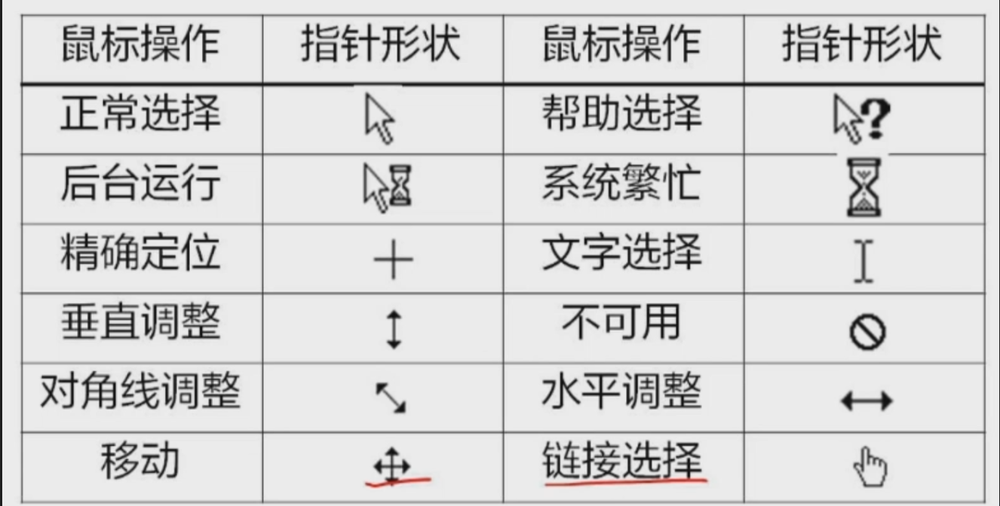

# 计算机软件及使用

## windows 10 操作系统

下文将windows 10 简写为win10

### win10的特点，win10的运行环境及安装方法

1. 特点
   - 开始菜单回归
   - 统一的应用商店
   - 多任务桌面
   - cortana语音助手
   - edge浏览器
   - 安全性增强
   - 更新和支持
2. 运行环境：个人电脑；笔记本电脑；平板电脑等设备上运行
3. 安装方法
   - **准备安装媒介**：获取 Windows 10 安装文件，可以通过微软官方网站下载安装程序，或者购买安装光盘/USB驱动器。
   - **备份数据**：在安装 Windows 10 之前，建议备份计算机中重要的数据，以防数据丢失。
   - **运行安装程序**：如果是通过光盘/USB驱动器安装，将安装介质插入计算机并启动计算机。如果是通过下载的安装程序，直接运行安装程序。
   - **按照提示进行安装**：按照安装向导的提示，选择语言、时区、安装选项等，然后等待安装过程完成。
   - **激活系统**：在安装完成后，根据需要激活 Windows 10。如果你有有效的产品密钥，可以在安装过程中输入密钥进行激活，或者在安装完成后进入系统设置中进行激活。

### win10的基础知识和基本操作

> 是多任务、多窗口的操作系统

1. 桌面和任务栏
   - win10桌面是你与计算机交互的主要界面，你可以在桌面上放置应用程序、文件和文件夹。
   - 任务栏位于桌面底部，包含：
     - “开始”按钮
       - 开始菜单位于任务栏左侧，用于快速访问应用程序、文件和设置
       - 单击“开始”按钮可打开开始菜单，其中包括已安装的应用程序、最近使用的文件和设置选项
     - 快速启动
     - 任务视图按钮程序按钮区
     - 系统通知区
     - 系统托盘
     - 显示桌面
2. 设置：在 Windows 10 中，设置应用程序是管理系统设置的中心，进行系统设置、个性化、设备、网络和 Internet、应用、账户等操作。
3. 多任务操作：可以在桌面上同时打开多个应用程序和窗口
4. 搜索：Windows 10 提供了强大的搜索功能，可以快速找到文件、应用程序、设置等内容。，也可以使用快捷键 Win + S 打开搜索栏。
5. 常见的窗口操作
   - 切换窗口
     - 点击要选择窗口的任意部分
     - alt+tab 进行切换
     - alt+esc 打开顺序循环切换
   - 关闭窗口
     - alt + f4快速关闭窗口
6. 菜单：控制菜单、快捷菜单、命令菜单
   - 灰色字符的菜单命令：用户不可使用
   - 带省略号的菜单命令：可以打开一个相应的对话框
   - 复选菜单
   - 单选菜单
   - 快捷键
   - 单箭头的命令：有下一级的子菜单
7. 文件的命名规则
   - 不区分大小写
   - 开头不能使用空格
   - 文件扩展名可以使用多个字符，使用多分隔符，但只有最后一个分隔符后的部分能做文件的扩展名。
   - 不允许同目录下有两个相同文件名。
   - 文件中不能使用的字符有/\*：”？<>等。⭐
8. 文件资源管理器/文件和文件夹的基本操作：文件资源管理器是 Windows 10 中用于管理文件和文件夹的工具。
   - 选择文件
     - 选定连续的文件/文件夹
       - 用鼠标拖动出虚线框来选择；
       - 选择第一个文件/文件夹，按住Sit,然后单击最后一个文件/文件夹。
     - 选择不连续的文件/文件夹
       - 按住Ctr键，依次单击文件/文件夹。
     - 全选：按Ctrl+A组合键。
   - 复制或移动
     - 选择对象(文件/文件夹) → 单击窗口菜单栏“编辑” → “复
       制”/“剪切” → 选择目标位置 → 单击窗口菜单栏“编辑” → “粘贴”
     - 选择对象 → 右击 → “复制”/“剪切” →选择目标位置 → 右击 →“粘贴”；
     - 选择对象 → Ctrl+C/Ctrl+X → Ctrl+V;
     - 使用拖动法：如果在不同的盘符下，如C盘拖到D盘，是复制操作；如果直接拖动在相同盘符下，则是移动操作。
   - 删除
     - 可恢复性删除
       - 选择文件/文件夹→按Del;
       - 选择文件/文件夹 → “文件” → “删除”；
       - 选择文件/文件夹 → 直接拖入回收站；
       - 选择文件/文件夹 → 右键单击 → “删除”；
       - 选择文件/文件夹“组织” → “删除”。
     - 不可恢复性删除：shift + delete
9. 回收站
   - 用于存放被删除的文件或文件夹。其只能存放硬盘上被删除的文件或文件夹和快捷方式。
   - 回收站的删除和清空是永久性删除，是不可恢复的。
   - 若要恢复被删除的文件，可在回收站窗口中，选定要恢复的对象→单击“文件”菜单项→“还原”；或在回收站窗口中，右击要恢复的对象→选择“还原”。
10. 系统设置
    - 当前屏幕图像拷贝
      - 拷贝当前屏幕图像：按PrtSc键。
      - 拷贝当前窗口图像：按Alt+PrtSc键；
      - 或用Windows7中的截图工具。
    - 快捷方式的创建
      - 右击桌面背景→“新建”→“快捷方式”；
      - 选中相应的对象，右击→“发送到”→“桌面快捷方式”；
      - 选中相应的对象，右击“创建快捷方式”(快捷方式创建在当前 位置)
    - 输入法的设置
      - 启动和关闭输入法：Ctrl+Space组合键。
      - 输入法切换：按Ctrl+Sift组合键或单击“输入法指示器”按钮，在弹出的输入法菜单中选择一种汉字输入法。
      - 全角/半角切换：按Shift+Space组合键或单击输入法状态窗口中的全角/半角切换”按钮。
      - 中英文标点切换：按Ctrl+.组合键单击“输入法状态窗口”中的中英文标点切换按钮。
    - 任务管理
      - 同时按下组合键Ctrl+Alt+Delete键
      - 其功能是管理应用程序、进程管理、监视系统性能和联网状况，当计算机出现“死机”或程序长时间未响应的时候会使用该功能
    - 剪贴板：剪贴板是Windows提供的信息传送的中转站，是计算机内存中的一块区域。利用剪贴板可以在不同的应用程序之间、同一个应用程序的不 同文档之间、同一个文档中不同位置的信息之间实现传送。传送的信息可以是文字、符号、图形、图像等。
11. 鼠标操作：移动、指向、单击、双击、拖拽
    
12. 常用组合按键⭐
    - Ctrl+C/Ctrl+X/Ctrl+V/Ctrl+S/Ctrl+A：复制/剪切/粘贴/保存/全选
    - Ctrl+Z/Ctrl+Y：撤销/重做
    - Ctrl+F：查找
    - Ctrl+空格 切换中/英文输入法
    - Ctrl+shift 循环切换输入法
    - Ctrl+. 切换中/英文标点
    - Shift+空格 全角/半角切换
    - Alt+Tab 任务之间切换
    - Alt+F4 关闭
    - F1 在线帮助
    - ESC 取消
13. 将内容放入剪贴板的方法⭐
    - 复制操作：Ctrl+C
    - 剪切操作：Ctrl+X
    - 复制当前窗口：Alt + Print Screen
    - 复制整个屏幕：Print Screen
    - 取出的方法只有粘贴：Ctrl+V

### 理解操作系统的基本原理及组成结构、基本概念、特征、特性和用途

1. 操作系统的基本原理：操作系统是一组控制和管理计算机硬件和软件资源，合理地对各类 作业进行调度，以及方便用户使用的程序的集合
2. 组成结构：内核、系统调用接口、外壳（Shell）
3. 基本概念：进程、线程、调度、死锁、虚拟内存、并发、共享、异步
4. 特征：并发性；共享性；虚拟性；异步性；
5. 用途：系统资源管理；系统任务调度；系统设备管理；使程序员更容易地完 成他的工作

补充操作系统的发展

- 无操作系统时的计算机系统
  - 手工操作阶段
  - 脱机输入/输出技术
- 单道批处理操作系统
- 多道批处理技术
- 分时操作系统：多路性；独立性；及时性；交互性
- 实时操作系统：实时控制；实时信息处理；多路性；独立性；及时性；交互性；可靠性

### 掌握进程控制的基本原理和方法；了解处理机调度和死锁基本原理和方法

1. 进程：进程是具有独立功能的可并发执行的程序在一个数据集合上的运行过程，是系统进行资源分配和调度的独立单位。或者说，“进程”是进程实体的运行过程。
   - 前趋图 ->
   - 程序顺序执行：顺序性；封闭性；可再现性；
   - 程序并发执行：是指若干个程序同时在系统中运行：间断性；失去封闭性；不可再现性
   - 特征：动态性；并发性；独立性；异步性；
   - 状态与转换
     - 就绪状态：当进程已分配到除 CPU 以外的所有必要资源，只要获得 CPU，便可立即执行。
     - 执行状态：进程已获得 CPU，正在执行，单处理机系统中，只有一个进程处于执行状态。
     - 阻塞状态：进程不具备运行的条件，如申请的资源（除 CPU 外）未满足，等待某事件等
     - 进程在运行期间不断地从一个状态转换到另一个状态，进程的各种调度状态依据一定的条件而发生变化，它可以多次处于就绪状态和执行状态，也可多次处于阻塞状态，但可能排在不同的阻塞队列
   - 进程控制块PCB：系统根据PCB感知进程的存在，并对其进行控制和管理，PCB是进程存在的唯一标志。
   - 进程的创建
     - 申请空白PCB
     - 为新进程分配资源
     - 初始化进程控制块
     - 将新进程插入就绪队列
   - 进程的终止
     - 根据被终止进程的标识符从 PCB 集合中检索出该进程的 PCB，从中读出该进程的状态
     - 若被终止进程正处于执行状态，应立即终止该进程的执行并设置调度标志为真，用于指示该进程被终止后应重新进行调度，选择一新进程，把处理机分配给它
     - 若该进程还有子孙进程，还应将其所有子孙进程予以终止，以防它们成为不可控的
     - 将该进程所拥有的全部资源，或者归还其父进程或者归还给系统
     - 将被终止进程的 PCB 从所在队列中移出，等待其他程序来搜集信息
   - 进程阻塞与唤醒：对处于阻塞状态的进程，当该进程期待的事件出现时，由发现者进程调用唤醒原语 wakeup()将阻塞的进程唤醒，使其进入就绪状态。
   - 进程的挂起与激活：suspend()与active()
   - 进程通信类型：共享存储器系统；消息传递系统以及管道通信系统
2. 调度机制
   - 线程概念：是为了减少程序并发执行时所付出的时空开销，进一步提高系统内程序并发执行的程度，提高系统吞吐量，使操作系统具有更好的并发性
     - 是进程内的一个执行单元
     - 是进程内的一个可调度实体
     - 是进程内相对独立的一个控制流序列
     - 是执行的上下文，其含义是执行的现场数据和其他调度所需的信息
     - 是进程内一个相对独立的、可调度的执行单元
   - 进程调度：是指系统按照某种策略，从就绪队列中选择一个进程，将处理机分配给它，以执行该进程
     - 高级调度：高级调度又称宏观调度、作业调度或长程调度，其主要任务是按一定的原则从外存上 处于后备状态的作业中选择一个或多个作业，给它们分配内存、输入输出设备等必要的资源， 并建立相应的进程，再将新创建的进程排在就绪队列上，准备执行。高级调度的运行频率较低，通常为几分钟—次
     - 低级调度：低级调度又称进程调度、短程调度或微观调度，其主要任务是按照某种策略和方法从 就绪队列中选取一个进程，将处理机分配给它。进程调度的运行频率很高，一般几十毫秒要运行一次
     - 中级调度：中级调度又称中程调度或交换调度，引入中级调度的目的是为了提高内存利用率和系统 吞吐量。其主要任务是按照给定的原则和策略，将处于外存对换区中的重又具备运行条件的进程调入内存，或将处于内存的暂时不能运行的进程交换到外存对换区
   - 典型算法
     - 先来先服务
     - 短作业优先
     - 时间片轮转调度算法
     - 优先级调度算法
     - 高响应比优先调度算法
     - 多级反馈队列调度算法
3. 死锁原理和解决方法
   - 死锁的定义：是指进程间相互等待对方所占的资源，从而导致进程进入死锁状态，无法向前推进。
   - 死锁的四个必要条件：
     - 互斥条件：进程对所分配的资源进行排他性使用，即在一段时间内某资源仅为一个进程所占有。此时若有其他进程请求该资源，则请求进程只能等待。
     - 请求和保持条件：进程已经保持了至少一个资源，但又提出了新的资源请求，而该资源已被其他进程占有，此时请求进程被阻塞
     - 不可剥夺条件：进程所获得的资源在未使用完毕之前，不能被其他进程强行夺，即只能由获得该资源的进程自己来释放
     - 循环等待条件：有一组进程{P0，P1，…，Pn}，在发生死锁后，这 n 个进程之间形成首尾相接的循环等待资源关系。即进程P0正在等待一个P1占用的资源，而进程P1正在等待一个P2占用的资源，依此类推，形成一个进程等待链（注意：该链中的每个进程都在等待下一个进程所占有的资源）。
   - 死锁的解决方法：
     - 预防死锁
       - 摒弃“请求和保持”条件
       - 摒弃“不可剥夺”条件
       - 摒弃“不剥夺”条件
     - 避免死锁
       - 安全状态与不安全状态
       - 利用银行家算法避免死锁
     - 检测死锁
       - 资源分配图
       - 死锁定理
     - 解除死锁
       - 剥夺资源
       - 撤消进程

补充中断

> 所谓中断是指系统发生某一事件后，CPU 暂停正在执行的程序转去执 行处理该事件的程序过程，处理中断事件的程序称为中断处理程序，产生中断信号的那个部 件称为中断源。硬件的中断机构与处理这些中断的程序统称为中断系统

- 类型
  - I/O中断
  - 程序性中断
  - 访管中断
  - 强迫性中断
  - 自愿性中断

### 资源管理器的使用，文件和文件夹的概念与操作

参考win10的基础知识和基本操作的第八点

1. 资源管理：操作系统负责管理和分配计算机硬件资源，包括处理器、内存、存储设备、输入输出设备等，以满足不同应用程序的需求
2. 文件管理：文件管理的主要任务是有效地支持文件的存储、检索和修改等操作
   - 文件存储空间的管理：负责对文件存储空间进行管理，包括存储空间的分配与回收等 功能。
   - 目录管理：目录是用来管理文件的数据结构，它能提供按名存取的功能、
   - 文件操作管理：实现文件的操作，负责完成数据的读写
   - 文件保护：提供文件保护功能，防止文件遭到破坏

### 控制面板的相关知识及使用方法

> 是操作系统设置和配置的中心

- 打开方式
  - 开始菜单中搜索“控制面板”，然后点击打开
  - 在任务栏的搜索框中输入“控制面板”，然后点击打开
  - 在运行对话框中输入“control”，然后点击打开
- 常见设置
  - 系统和安全：包括系统、安全和维护、Windows Defender防病毒软件、Windows防火墙等。
  - 网络和Internet：包括网络和共享中心、Internet选项、无线网络设置等。
  - 硬件和声音：包括设备和打印机、鼠标、键盘、声音等硬件设置。
  - 程序：包括卸载程序、启用或禁用Windows功能等。

### 多媒体的管理及使用，掌握存储器和虚拟存储器管理的基本原理和方法

1. 多媒体管理及使用
2. 存储器管理和虚拟存储器管理：存储器管理的主要任务是对内行进行分配、保护和扩充。
   - 内存分配：按一定的策略为每道程序分配内存
   - 内存保护：保证各程序在自己的内存区域内运行而不相互干扰
   - 地址映射：将地址空间的逻辑地址转换为内存空间与之对应的物理地址
   - 内存扩充：为允许大型作业或多专业的运行，必须借助虚拟存储技术去获得增加内存的效果

### 了解操作系统的安全需求和访问控制策略、理解认证机制、授权机制和加密机制的基本概念

> 通过合理配置和使用认证、授权和加密机制，可以有效地确保操作系统和计算机系统的安全性，防止未经授权的访问和数据泄露，保护系统中的数据和资源

1. 安全需求：
   - 操作系统的安全需求是指确保计算机系统的机密性、完整性、可用性和可靠性。这意味着保护系统中的数据和资源不受未经授权的访问、修改或破坏。
2. 访问控制策略：
   - 访问控制策略是指通过规定谁可以访问系统的什么资源以及在什么条件下进行访问来管理系统的访问。常见的访问控制策略包括最小授权原则、需知原则、责任分离原则等。
3. 认证机制：
   - 认证是验证用户或实体的身份的过程。认证机制用于确定用户是否具有访问系统资源的权限。常见的认证机制包括密码认证、生物识别认证、证书认证等。
4. 授权机制：
   - 授权是根据用户的身份和角色给予其访问系统资源的权限的过程。授权机制定义了哪些用户或实体具有对系统资源的访问权限，并规定了访问权限的范围和条件。
5. 加密机制：
   - 加密是将数据转换为密文形式，以保护数据的机密性和完整性的过程。加密机制用于保护数据在传输和存储过程中不被未经授权的访问者获取或篡改。常见的加密技术包括对称加密、非对称加密、哈希函数等。

## 文字处理软件 word 2016

### word 2016的功能；word 2016的启动方式和工作窗口

1. 功能和特点
   - 所见即所得：用户编辑的效果与打印输出效果一致
   - 多媒体混排：支持文字、图形、图像、声音、动画、艺术字等
   - 强大的制表功能：制作方法多样、灵活、美观、快捷
   - 自动功能：自动排版、自动更正、自动摘要
2. 启动方式
3. 工作窗口
   - 菜单栏：文件、编辑、格式、视图、工具、帮助

### word 2016的和基本知识和基本操作

基本知识 + 基本操作在其他内容中都已经介绍了

### 文档的创建、编辑、保存、打印和保护等基本功能

1. 创建：掌握新建文档的方法以及新文档暂时命名的形式
2. 打开
   - 使用“文件”菜单的“打开”菜单项
   - 使用常用工具栏的“打开”按钮
   - 使用“资源管理器”或“我的电脑”
3. 编辑
   - 插入点的移动：Home，End，Ctrl+Home，Ctrl+End,
   - 选定
     - 双击，单个单词
     - 单击拖动/shift，连续若干文本
     - 键盘选取：按住Shift键，按↑、↓、←、→键，可以选择内容
     - 双击之后三击，选定一段文本
     - 三击，Ctrl+A，选定整个文档
     - Alt，选定列块
   - 移动和复制文本：鼠标和快捷键
   - 撤销和恢复：Ctrl+Z，Ctrl+Y
   - 查找、替换和定位：Ctrl+F，Ctrl+H，ctrl + G
   - 删除
     - Backspace删除光标左侧（前面）的文字。
     - Delete按键是删除光标右侧（后面）的文字。
     - Ctrl+X也可以完成删除的操作，只不过是把选中的内容放到了剪切板中。
4. 保存：Ctrl+S
5. 打印：Ctrl+P
   - 选择“文件”→“打印”，可以查看打印预览，设置打印份数等。
   - 打印页数的设置
     - 若只打印文档中的一页，在图中所示的“页数”处输入要打印的页数，如“3”；
     - 若需打印连续的一部分页数，则在两个页数之间加个横线“.” 如“2-8”；
     - 若需打印不连续的页数，则在不同页数之间加个逗号“,”，如“2,3,5”
6. 保护：Ctrl+Shift+P

### 设置字体和段落格式等文档排版的基本知识与操作；表格的基本操作；图形及图文混排的基本知识与操作

1. 文字排版
   - 字体、字形和字号
     - 字号有大写和小写两种格式
       - 对于大写字号，字号越小，字越大
       - 对于小写字号，字号越大，字越大
     - 字体⭐：中文默认宋体、英文默认为Times New Roman；中英文均默认五号字
   - 设置颜色、边框和底纹、首字下沉、加下划线或者重号、动态效果和改变字间距等
     - 在“格式”工具栏中选择
     - 单击“格式”菜单中的“字体”命令来设置文字的格式
2. 段落格式
   - 对齐方式⭐：左对齐（格式栏中没有）、右对齐、居中对齐、两端对齐（默认）、分散对齐
   - 缩进方式⭐：首行缩进、左缩进、右缩进、悬挂缩进
   - 段前段后距离、行间距
   - 格式刷⭐
     - 作用：将选定的文字或段落的格式复制到指定的文字或段落
     - 使用方法
       - 选定所需格式的文本或段落
       - 单击“格式刷”按钮，使鼠标带上格式刷
       - 将带格式刷的鼠标指向待改变格式的文本或段落
       - 按住鼠标左键不放，拖动鼠标到结束位置
     - 注意
       - 如果要使多处复制相同的格式，第二步时双击“格式刷”按钮。使用结束后按“ESC”键或单击鼠标，关闭格式刷
       - 如果复制的属性是段落属性，在确定源格式时应包含段结束符
3. 表格
   - 创建
     - 自动创建表格
     - 绘制表格
   - 选定
     - 文本选定：与普通文本相同
     - 单元格选定：选定该单元格内所有文本即可选定该单元格；鼠标指向该单元格左侧适当位置（鼠标变成斜向右上方箭头）时单击
     - 行列的选定
   - 编辑
     - 调整行列
       - 直接使用表格线调整
       - 使用“表格”菜单调整：行高和列宽
     - 增加行和列
       - 选定行（列）或多行（列），再“菜单”或“工具按钮”插入即可
       - 若将光标置于最后一行的最后一个单元格，敲“Tab”键也可在表格的最后一行加 入一行
       - 若要在表格的最后一列右边加入一列，可选定该表格的最后一列右边的回车符， 然后使用插入列的方法插入一列。
   - 删除单元格、行、列即整表：“剪切”，Delete只能删除表格内容
   - 合并和拆分单元格
     - 合并单元格：选定要合并的单元格，使用“表格”菜单中的“合并单元格”命令
     - 拆分单元格：选定要拆分的单元格，使用“表格”菜单中的“拆分单元格”命令
   - 排序和计算：在 WORD 中，排序可以用工具栏上的升序或降序按钮，也可以单击“表格”菜单中 的排序命令来实现；排序列的列名称为关键字，系统最多允许 3 个关键字
4. 图形与图文混排
   - 环绕方式⭐：嵌入型(默认)、四周型、紧密型、衬于文字下方、浮于文字上方

### 文档的分栏、分页和分节等操作，文档页眉、页脚等页面设置；多窗口和多文档的编辑以及文档视图的使用

1. 分栏
   - 选定要分栏的段落
   - 选择“格式”菜单中“分栏”选项，并弹出对话框
   - 设置栏数、栏宽、间距、分割线等
   - 确定
2. 分页：插入分页符
3. 分节：插入分节符
4. 页眉页脚
   - 双击页眉页脚区域
   - 菜单插入
5. 多窗口：在不同的窗口可以查看同一个文档
6. 多文档：Ctrl+O 打开一个新文档
7. 文档视图
   - 页面视图：默认视图，最接近打印结果的视图
   - 阅读视图：不显示页眉页脚、标尺和排版效果、不显示插入文本框中内容
   - web版本视图：一网页的形式显示
   - 大纲视图：不显示页眉页脚、标尺和排版效果、不显示插入文本框中内容
   - 草稿：仅显示标题和正文；显示水平标志
8. 脚注和尾注：页面底端的注释称为脚注，文章末尾的注释称为尾注
   - 插入方法：“插入” → “引用” →“脚注和尾注”
9. 页面设置：可以设置纸张大小、纸张方向、页边距及分栏等

## 电子表格软件Excel 2016

### Excel 2016的基本功能：Excel 2016的启动方法和工作窗口

1. 基本概念：是对数据进行处理的软件
2. 启动方法
3. 工作窗口：Excel 2016的工作窗口由工作表、工作表窗口、状态栏、菜单栏、工具栏和功能区组成

### Excel 2016的基本知识和基本操作

基本知识和操作同理

### 工作簿和工作表的基本操作以及工作表的打印和输出

1. 工作簿：一个 EXCEL 文件，称为一个工作簿。一个工作簿最多由 255 张工作表构成。 系统默认一个工作簿由 3 张工作表构成。工作簿的默认文件名为 BOOK1、BOOK2…， 扩展名.xls
   - 创建：就是创建一个xls文件
   - 删除、复制等：都是文件的操作
2. 工作表：：由 65536 行与 256 列构成。工作表的默认名称为 Sheet1、Sheet2、Sheet3...
   - 插入：shift + f11
   - 删除：永久删除不能恢复
   - 移动：可以在当前和不同工作簿中移动

### 数据的排序、筛选、对比、分类汇总、合并计算和数据有效性等操作

1. 排序：排序点击文本的排序即可
2. 筛选：筛选过的数据仅显示那些满足指定条件的行，并隐藏那些不希望显示的行
   - 自动筛选
   - 高级筛选：可以指定输出结果
3. 对比
4. 分类汇总
   - 分类汇总就是对数据清单按某字段进行分类，将字段值相同的 连续记录作为一类，进行求和、平均、计数等汇总运算。
   - 使用分类汇总之前，要对进行分类汇总的列进行排序。并且要保证数据格式是清单格式、数据清单中不能有空列或空行。
   - 分类汇总方式可以是：求和、平均值、最大值、最小值、乘积、 方差等。
5. 合并计算数据有效性

### 工作表、数据图表的建立、编辑、管理及格式化操作

1. 创建图表的方法：选择用于生产图表的数据，然后单击“插入”→“图表”→“图表类型”
2. 图表的种类
   - 嵌入式工作表：图标与数据源在同一个工作表中，作为该工作表的一部分，称为嵌入式工作表
   - 独立工作表：图表存放在单独的工作表中，也就是与数据源不在同一个工作表中

注意：

- 图表中的各项都是可以进行编辑的
- 图表中的数据和原始数据是相关联的，即修改图表中的数据，表格中数据将随着改变，修改表格中的数据，图表中的数据将随之改变

补充单元格中输入格式

1. 文本：默认左对齐
2. 数字：默认右对齐，会自动去0，加单引号可以变成文本类型
3. 分数：先输入0，空格，然后输入分数
4. 日期和时间
   - 右对齐
   - ctrl + “；”可输出当天日期
   - shift + ctrl + “；”可输出当天时间
5. 输入指定数据：可以在数据选项卡设置“数据验证”

自动填充时：默认是等差数列的填充

### 单元格的引用、计算以及公式和常用函数的使用

1. 单元格的引用
   - 相对引用：如果公式所在单元格的位置改变，引用也随之改变。如果多行或多列地复制公式，引用会自动调整。默认情况下，新公式使用相对引用。如在C2单元格中输入“=A2+B2”,则复制至C3、C4,公式自动变为“=A3+B3”和“=A4+B4”
   - 绝对引用：公式所在单元格的位置改变，绝对引用的单元格始终保持不变。如果多行或多列地复制公式，绝对引用将不作调整。默认情况下，新公式使用相对引用，需要将它们转换为绝对引用。如在C2单元格输入“=$A$2+$B$2”,则复制至C3、C4时，公式仍为“=$A$2+$B$2”和“=$A$2+$B$2”,未发生变化。
   - 混合引用：混合引用具有绝对列和相对行，或是绝对行和相对列。绝对引用列采用$A1、$B1等形式。绝对引用行采用A$1、B$1等形式。如果公式所在单元格的位置改变，则相对引用改变，而绝对引用不变。如在C2单元格输入“=A$2+$B2”,则复制至C3、C4时，公式自动变为“=A$2+$B3”和“=A$2+$B4”。
   - 总结绝对是加$符号⭐
2. 计算以及公式和常用函数
   - 在Excel2013中，公式最前面是等号“=”，后面是参与计算的数据对象或运算符。
   - 公式的组成一般有三部分：等号、运算项、运算符。
     - 运算符
       - 引用运算符：：(冒号)、(空格)、，(逗号)。
       - 算术运算符：负数(如-1)、%、^(乘方)、\*和/、+和
       - 文本运算符：&
       - 比较运算符：=、<、>、>=、<=、<>
   - 函数
     - 单独的函数位于公式之首，要以等号“=”开始；若是嵌套的函数，前面不加等号“=”；
     - 函数名称后是括号“()”。括号必须成对出现；
     - 括号内是函数的参数，以逗号分隔多个参数。参数可以是数值、文本、逻辑值、数组、错误值或单元格引用。
   - 常见的函数
     - 平方根函数：SQRT（参数）
     - 求余函数：MOD（A，B）
     - 绝对值函数：ABS（参数）
     - 取整数：INT（参数）
     - 求最大值函数MAX(A1,A2,...)
     - 求最小值函数MIN(A1,A2,...)
     - 四舍五入函数：ROUND（单元格，保留小数位）
     - 求和函数SUM(A1,A2,...)
     - 平均数函数AVERAGE(A1,A2,...)
     - 统计函数COUNT(A1,A2,...) ⭐
     - 条件函数IF(P,T,F) ⭐ 其中P是能产生逻辑值(TRUE或FALSE)的表达式，T和F是表达式。功能：若P为真(TUE),则取T表达式的值，否则，取F表达式的值。

### 数据管理与分析的一般功能和使用方法

1. 数据输入与导入：
   - 手动输入数据：直接在Excel工作表中输入数据。
   - 导入外部数据：从其他文件或数据库中导入数据，如CSV文件、文本文件、数据库等。
2. 数据格式化与清洗：
   - 格式化数据：对数据进行格式设置，包括数字格式、日期格式、文本格式等。
   - 清洗数据：清除重复项、删除空白行、处理错误值、填充空缺值等。
3. 数据排序与筛选
4. 数据计算与公式
5. 数据透视表与透视图：
   - 创建数据透视表：使用数据透视表功能对数据进行汇总和分析，快速生成汇总报表。
   - 制作透视图：通过透视图功能对数据进行可视化分析，如柱状图、折线图、饼图等。
6. 数据图表与图表分析：
   - 创建图表：使用Excel的图表功能将数据可视化展示，如柱状图、折线图、散点图等。
   - 分析图表：分析图表趋势、关联性，挖掘数据背后的规律和趋势。
7. 数据验证与审查：
   - 数据验证：设置数据输入时的有效性验证规则，确保数据的准确性和完整性。
   - 数据审查：通过审查工具检测数据中的错误、不一致性和异常情况，进行修正和处理。
8. 数据报表与导出：
   - 创建数据报表：将数据进行汇总和整理，制作成报表并进行格式设置。
   - 导出数据：将Excel中的数据导出为其他格式，如PDF、CSV、图像等。

### 工作簿和工作表的安全性和跟踪协作

1. 工作簿的安全性：
   - 密码保护：可以为整个工作簿设置密码，以防止未经授权的访问和编辑。通过“文件” > “信息” > “保护工作簿”可以设置密码保护。
   - 权限管理：可以设置不同用户对工作簿的不同权限，如只读、修改或完全控制。通过“文件” > “信息” > “权限管理”可以设置权限。
2. 工作表的安全性：
   - 隐藏和保护工作表：可以隐藏工作表并设置密码保护，以防止其他用户查看或修改工作表内容。通过右键单击工作表标签并选择“隐藏”和“保护工作表”可以实现这一功能。
   - 设置单元格锁定：可以设置某些单元格为只读或者锁定，防止其他用户编辑这些单元格的内容。在“格式” > “保护单元格”中设置相关选项。
3. 跟踪协作：
   - 共享工作簿：可以将工作簿共享给其他用户，允许多人同时编辑同一份Excel文件。通过“文件” > “共享” > “共享工作簿”可以设置共享选项。
   - 追踪更改：可以启用“追踪更改”功能，记录工作簿中的所有更改和编辑操作，并标记作者和时间。通过“审阅” > “追踪更改”可以启用该功能。
4. 版本控制：
   - 保存版本：可以定期保存工作簿的不同版本，以便于回溯和恢复到之前的某个版本。通过“文件” > “版本” > “保存版本”可以保存当前版本。
   - 查看版本历史：可以查看工作簿的版本历史记录，了解每个版本的修改内容和作者。通过“文件” > “版本” > “查看版本历史记录”可以查看版本历史记录。

## C语言程序设计

> 这个就不总结了直接刷题

### 程序设计与程序设计语言的基本概念

### C语言的历史和特点，常见C语言程序开发环境的使用

### C语言的基本语法与简单程序设计，包括基本数据类型、运算符与表达式，数据的输入与输出，基本程序流程控制语句，函数、编译预处理与存储属性

### 指针及其应用

### 高级数据结构及其应用，包括数组、字符串、结构、联合、位域、枚举和文件、位运算、链表

补充PPT

1. 新建幻灯片 ctrl+m、enter按键
2. 选中
   - 单张：点击选中
   - 多张
     - 连续：shift
     - 不连续：ctrl
3. 视图视图：主要的编辑视图，可用于撰写或设计演示文稿。也可以完成幻灯片的复制、移动、删除、插入等操作。
   - 大纲视图：与普通视图的区别在于普通视图左侧显示的是缩略图，大纲视图显示的是占位符中的内容。
   - 幻灯片浏览视图：幻灯片浏览视图是以缩略图形式显示幻灯片的视图。结束创建或编辑演示文稿后，幻灯片浏览视图显示演示文稿的整个图片，使重新排列、添加或 删除幻灯片以及预览切换和动画效果都变得很容易
   - 备注页视图：用来显示和便捷备注页内容。
   - 幻灯片放映视图：幻灯片放映视图占据整个计算机屏幕，就象对演示文稿在进行真正的幻灯片放映。在这种全屏幕视图中，您所看到的演示文稿就是将来观众所看到的。您可以看到图形、时间、影片、动画元素以及将在实际放映中看到的切换效果。
   - 母版视图
     - 幻灯片母版：可以对整个演示文稿中的所有幻灯片设置相同的内容，可以用来统一幻灯片的格式，在幻灯片母版上添加元素，必须在幻灯片母版上进行修改。
     - 讲义母版：讲义母版可以用来控制打印的演示文稿讲义外观。在讲义母版中可以添加或修改讲义的页眉或页脚信息，并可以重新设置讲义的格式。对讲义母版的修改只能在打印出的讲义中得到体现。
     - 备注母版：备注母版主要用来格式化演示文稿的备注页面，控制备注页的版式和文字的格式
4. 超链接：超链接是指从一个幻灯片指向一个目标的连接关系，这个目标可以是另一个网页，也可以是相同演示文稿上的不同位置，一个电子邮件地址，一个文件，甚至是一个应用程序。但不能连接到幻灯片中的元素上。
5. 动画
   - 幻灯片切换选项卡
     幻灯片切换是幻灯片的出现效果。 
     在效果选项中，可以设置放映幻灯片的切换方式。 
     当点击的时候，直接可以设置当前选中幻灯片的切换方式，也可以在“计时”选项中选全部应用，这样所有幻灯片可以设置相同的切、换效果。
   - 动画选项卡
     为幻灯片中的对象设置自定义动画效果，能够改变幻灯片中播放对象的顺序。自定义动画的对象是本幻灯片中的元素，设置好后可以在效果选项中设置动画的效果。
   - “幻灯片放映”选项卡
     - 首页播放：“幻灯片放映”→“从头开始”或F5键
     - 从当前页播放：“幻灯片放映”→“从当前幻灯片开始”或者Shift+F5。
     - 结束幻灯片放映：Esc;Alt+F4
