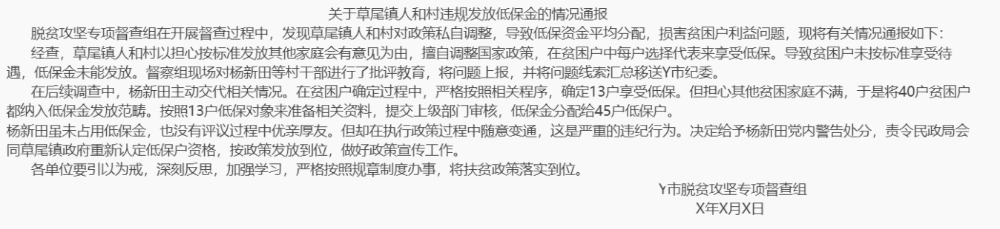
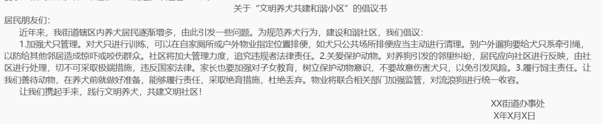

# 概括类文章

## 作答核心思路

1. 审清写作目的。写作目的决定了主体部分的内容
2. 确定作答结构。公文题作答结构包括开头、主体、结尾三个部门，开头一般交代背景目的，背景可以是发展趋势，如果材料中背景段给出问题，也可以作
   为背景提出；主体部分按照文体和题干要求，有什么写什么，结尾部分一般是提出要求、呼吁号召或者积极展望
3. 把握语言风格。标准公文一般要求严谨规范，写作语言为书面语，而面向群众的文章一般要求通俗易懂，语言更加灵活
4. 写作格式。标题、称呼和落款属于格式，如果题干要求提纲或要点则不用写格式。格式的写法为：标题居中写，称呼顶格写，落款放在结尾下一行右下
   角，其中单位右空四格，日期对照单位居中写。 
   题目要求写提纲或者答题要点时，如果不分段可以按照：背景：经验：123号召：这种方式体现出逻辑；如果分段，则不用写
5. 公文题的字数安排，400字公文，开头50字，结尾25字，主体部分内容不分段，按1.2.3.写成一段即可；500字公文，开头50-75字，结尾25-50字，主体
   部分可以根据情况是否分段，标准类按照一、二、三、排序；其他类型按照小标题体现逻辑顺序

## 标准公文

### 意见

> 适用于重要问题提出见解和处理办法，考试中常见指导意见

写作结构：意见分标题、主送机关、正文和落款。

- 标题：由发文机关、主要内容、文种三者共同构成
- 主送机关：写明呈送单位名称。
- 意见的正文：一般由开头、主体、结尾组成 
  开头部分概括性说明制定意见的缘由，目的或依据。常用“现提出如下意见”作为承启语转入意见的主体部分。 
  主体部分主要围绕如何解决进行展开。
  结尾可提出要求，请下级结合实际情况贯彻执行。
- 落款：写发布机关的名称和年、月、日。

    典型例题：三、假定你是某街道动事处的一名工作人员，请根据给定材料6~8，拟写一份《某街道办事处关于改进老年人服务工作的指导意见》。(25分) 
    要求：文字简明，分条撰写，有指导性与可行性；不超过400字。

### 通知

> 适用于发布、传达要求下级机关执行和有关单位周知或者执行的事项，批转、
> 转发公文。

写作结构：标题、主送机关、正文和落款。

- 标题：由发文机关、主要内容、文种三者共同构成，也可只写"通知"
- 主送机关：写被通知单位名称。
- 意见的正文：指示性通知主体部分写做法 
  结尾可提出要求，请各单位结合实际贯彻执行。
- 落款：写发布机关的名称和年、月、日。
  

### 报告

> 适用于向上级机关汇报工作、反映情况，回复上级机关的询问

写作结构：报告的结构包括标题、主送机关、正文、落款。

- 标题：由发文机关、主要内容、文种三者共同构成。
- 主送机关：写明呈送单位名称。
- 正文：开头写背景目的 
  主体部分，专题报告写1基本情况（成绩）；2.经验做法（占主要部分）；3.存在问题（材料中有就写）；4.下一步打算（解决存在的问题，概括写） 以汇报经验为主的报告，主体部分写做法
- 落款：写发布机关的名称和年、月、日。

    典型例题：三、"给定材料6”提到山西省治超工作取得了阶段性成果。假如你是省治超办的一名工作人员，请起草一份上报省政府的治超工作情况汇报。(20分) 
    要求：格式规范，概述准确，切合题意，结构清晰；不超过600字。

 

### 通告

> 适用于在一定范围内公布应当遵循或者周知的事项

写作结构：通告的结构包括标题、主送机关、正文、落款。

- 标题：由发文机关、主要内容、文种三者共同构成。
- 称呼：写通告对象，如市民朋友们：网民朋友们：
- 正文：开头写背景目的 
  主体部分，介绍通告内容，一般来说，申论考试中的通告是面向公众说明应该怎样做
- 落款：写发布机关的名称和年、月、日。

    典型例题：三、为了兼顾纳凉服务与交通安全，市轨道交通管理中心综合办拟发布一个关于加强地铁站内治理的通告。例如你是“综合办”的工作人员，请结合给定材料4，拟写此通告。(35分) 
    要求：内容全面，条理清晰，措施合理并有针对性，格式正确，350字左右。

 

### 通报 ⭐

> 通报适用于表彰先进、批评错误、传达重要精神和告知重要情况。

写作结构：通报由标题、主送机关、正文、落款和日期组成。

- 标题：标题：单位+事由+通报
- 称呼：由特定对象的通报可以写称呼，面向公众的不写称呼
- 正文：正文部分开头介绍背景目的，主体部分介绍通报内容，介绍相关情况，表明态度，说明下一步的做法
- 落款：写发布机关的名称和年、月、日

    典型例题：三、根据给定材料4，请你以Y市脱贫攻坚专项督查组的名义拟写一篇通报。(30分) 
    要求：文体正确、结构完整、内容全面、条理清晰，不超过500字。

 

## 调查（调研）汇报材料

> 材料中给出背景，针对某个具体问题展开调研，针对调研情况来撰写汇报材料（调研考察报告）

- 调研自身
  - 开头（背景、目的）
  - 主体：1)基本情况（或取得的成绩）；2)经验做法；3)存在的问题；4)下一步打算 
  以上内容，材料种给了什么就写什么。成绩材料给的少也可以概括性写在开头部分
  

    三、请根据“"给定资料5”，写一份L社区智慧社区020项目建设的调研报告。(25分)
     要求：结构完整，思路清晰，简明具体，不超过500字。
  

  
- 调研他人
  - 开头（背景、目的）
  - 主体：经验做法
  

    三、假如你是某省博物馆的工作人员，被派去考察故官文创产品开发情况。请你根据“给定材料4~5”，撰写一份向本单位领导汇报的考察报告要点。(15分)
     要求：内容全面，要点清晰，字数不超过400字。
  

  

## 公开信

> 政府部门给社会公众的一封信，目的是为了开展某项工作或者说明某个事项

写作结构：包括标题、主送机关、正文、落款。

- 标题：给XX的公开信（一封信）
- 称呼：写题干中给出的对象
- 正文：先判断群众是否需要在活动开展过程中采取相应的做法，如果不需要主体部门写好处，如果需要参与到活动当中那么则写做法；说明情况的公开信，主体部分的内容可以参考情况通报 
  结尾提出呼吁号召
- 落款：写发布机关的名称和年、月、日。

- 群众需要参与
  

    二、给定材料2介绍了县乡村垃圾分类工作取得的成绩，县情基本相似的岭邻县来学习取经后，决定启动这项工作。假设你是邻县负责此项工作的人员，为做
    好群众宣传动员工作，请拟定一份给你县农民群众的公开信。 
    要求：切合主题，条理清晰，语言流畅，字数在400-500字。
  

  
- 群众不需要参与
  

    二、L县政府拟进一步宣传寄宿制学校的办学模式，以期更好地提高办学效益和质量。请根据"给定材料3”，以县教育局的名义草拟《给洛村中小学生家长的一封信》。(20分)。 
    要求：内容具体，符合实际；用语得体，通俗易懂；不超过400字。
  

  
- 说明情况
  

  (三)“给定资料4”中，城管部门要求白师傅暂停修路的做法，引发社区居民质疑。请你以区城管局的名义，起草一份给居民的公开信，进行解释说明。(25分) 
  要求：(1)内容完整，条理清晰：(2)有针对性，有说服力；(3)篇幅300字左右。
  

  

## 宣传稿

> 在开展活动过程中，需要通过发布宣传稿让社会公众知悉活动，有的还需要提出一些具体做法

写作结构：标题、主送机关、正文、落款。

- 标题：需要自拟标题
- 称呼：写题干中给出的对象
- 正文：先判断群众是否需要在活动开展过程中采取相应的做法，如果不需要主体部门写好处，如果需要参与到活动当中那么则写做法； 
  结尾提出呼叮号召
- 落款：写发布机关的名称和年、月、日。
  在网站、刊物上的宣传稿不用写称呼和落款

- 群众需要参与
  

    (三)为加强急救教育，某市卫生部门和教育部门拟联合举办“急救知识进校园”活动。假如你是活动主办方的工作人员，请根据给定材料9，为该活动拟写份宜传稿。(25分)要求：1.切合活动主题；2.内容全面，条理清晰，有可行性，不超过400字。
  

  
- 群众不需要参与
  

    四、假设你是某市人社部门的工作人员，需要进社区向群众推广电子社保卡。请结合“给定材料4”，草拟一份介绍电子社保卡的宣传稿。(35分) 
    要求：结构完整，内容具体，条理清楚，语言准确；不超过400字。
  

  

## 倡议书

> 号召大家开展某项工作或某个活动，提出相关倡议。倡议即号召大家开展某个做法，作用倡议书主体部分以做法为主

  三、假如你是该街道办工作人员，请针对“给定材料3”中小区居民反映的情况，以“文明养犬共建和谐小区”为主题，撰写一份倡议书。(25分) 
  要求：格式正确。针对性强、条理清楚，不超过400字。

## 新闻稿、简报

> 适用于公开发表或内部发表的内容

写作结构：

- 标题：新闻稿、简报需要自拟标题
- 开头部分写背景和目的，主体部分需要报道的是某项工作时，则写做法+效果；需要报道的是好人好事时，主体部分写事迹和精神：需要报道的是领导参与活动时，主体部分按照流程来写。
- 结尾一般是积极展望，或提出号召

  典型例题：报道某项工作 
  三、假如你是某报社记者，请根据“给定材料3”，以“打造水清、水活、水美的活力水城”为题，写一篇报道。(20分) 
  要求：内容具体、全面：语言流畅，有逻辑性：不超过500字

  典型例题：宣传先进人物 
  3、假如你是H市公安局宣传处工作人员，请你根据“给定资料4”以“贴心的警察蓝'”为题目，撰写一篇新闻宣传稿。(25分) 
  要求：(1)紧扣资料，内容完整：(2)重点突出，语言流畅，(3)字数不超过500字。

## 讲话稿

> 讲话稿是各级领导、参与者会议、活动上发表带有宣传、指示、总结性质讲话的文稿

写作结构：

- 标题：在X会议上的讲话，如果考演讲稿则需要自拟标题
- 称呼：依据参会人员选用适当的称呼。如同志们：居民朋友们：
- 正文
  - 开头部分交代背景和目的：
  - 主体部分，动员类讲话写重要性+工作要求： 
  - 总结类讲话，主要写经验做法： 
  - 事迹报告会，主要写先进人物的事迹和精神： 
- 结尾：结尾一般是积极展望或者提出号召

- 动员讲话
  

    为了响应国家号召，深入推进新基建工作的开展，S省政府计划召开全市新基建工作推进会，假如你是省政府工作人员，请结合 “给定资料3”，为本次推进会 写一份讲话稿。(25分) 
    要求：(1)目的明确，切哈主题；(2)内容具体，层次清楚；(3)语言得体，表达简洁流畅；(4)不超过500字。
  

  
- 总结经验讲话
  

    4、假设C村所在的省份将开展一次关于古村的保护与开发的经验交谈会，请你根据材料5，写一份介绍C村保护和开发情况的发言稿。(20分)。 
    要求：紧扣材料，内容全面；逻辑清晰，语言准确；字数在500字左右。
  

  
- 事迹报告会
  

    3、某省正开展优秀共产党员先进事迹巡回宣讲活动，假设你是宣讲团的成员，请根据给定资料4，撰写一份“布衣院士”卢永根先进事迹的宣讲提纲。(25分) 
    要求：(1)紧扣材料，内容全面；(2)语言准确，有逻辑性；(3)字数不超过400字。
  

  

## 时评

> 对当前的社会热点事件中表现出的问题发表自己的见解

写作结构：

- 标题：自拟标题
- 正文：
  - 开头部分：介绍背景、目的
  - 主体部分：针对消极现象的时评，写危害、原因、解决措施
  - 观点类的时评，需要正、反两个方面进行分析，并提出相应措施
  - 总结类的时评，根据材料中的内容提炼出经验做法
- 结尾：结尾一般是积极展望或者提出号召

- 针对消极现象的时评
  

    四、某地方报纸根据“给定材料4”和“"给定材料5”的内容做了一版关于“跟风”的专栏，请你以“告别跟风，走向成熟”为题，为这个专栏写一篇短评。(20分) 
    要求：观点明确，简明深刻；紧扣材料，重点突出；语言流畅，有逻辑性；不超过500字。
  

  
- 观点类的时评
  

    四、为了消除社会上对“网络新一代”的疑虑，某报特邀市科协工作人员为该报“时评”栏目撰文。假如你是这位工作人员，请根据“给定材料4”为该报写一篇题为“正确看待网络新一代'”的短文。(20分) 
    要求：观点明确，简洁有力；紧扣材料，层次分明；语言流畅，有逻辑性：不超过500字。
  

  
- 总结类的时评
  

    三、请根据"给定材料3”，自拟标题，为D省日报撰写一篇关于C市诗城公园建设的短评。(30分) 
    要求：观点鲜明，简明扼要，语言生动。不超过400字。
  

  

## 编者按

> 编辑对材料内容表明观点，介绍梗概，吸引读者阅读的文体

  典型例题：M省日报准备根据“给定材料2”中先进人物、先进集体的事迹，刊发一篇专题通讯，请你为该通讯撰写一则“编者按”。(20分)  
  要求：全面、准确、简明扼要。不超过300字。

