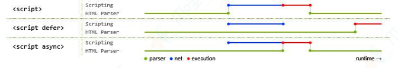

# HTML八股文

## 对HTML语义化的理解

语义化是指根据内容的结构化（内容语义化），选择合适的标签（代 码语义化）。通俗来讲就是用正确的标签做正确的事情。

语义化的优点如下：
对机器友好，带有语义的文字表现力丰富，更适合搜索引擎的爬虫爬 取有效信息，有利于SEO。除此之外，语义类还支持读屏软件，根据文章可以自动生成目录；
对开发者友好，使用语义类标签增强了可读性，结构更加清晰，开发 者能清晰的看出网页的结构，便于团队的开发与维护。

常见的语义化标签：

```html
<header></header>
头部
<nav></nav>
导航栏
<section></section>
区块（有语义化的div）
<main></main>
主要区域
<article></article>
主要内容
<aside></aside>
侧边栏
<footer></footer>
底部
```

## DOCTYPE(⽂档类型)的作⽤

DOCTYPE是HTML5中一种标准通用标记语言的文档类型声明，它的目的是告诉浏览器（解析器）应该以什么样（html或xhtml）的文档类型定义来解析文档，
不同的渲染模式会影响浏览器对CSS代码甚⾄JavaScript脚本的解析。它必须声明在HTML⽂档的第⼀⾏。

浏览器渲染页面的两种模式（可通过document.compatMode获取，比如，语雀官网的文档类型是CSS1Compat）：

CSS1Compat：标准模式（Strickmode），默认模式，浏览器使用W3C的标准解析渲染页面。
在标准模式中，浏览器以其支持的最高标准呈现页面。

BackCompat：怪异模式(混杂模式)(Quickmode)，浏览器使用自己的怪异模式解析渲染页面。
在怪异模式中，页面以一种比较宽松的向后兼容的方式显示。

## script标签中defer和async的区别

如果没有defer或async属性，浏览器会立即加载并执行相应的脚本。
它不会等待后续加载的文档元素，读取到就会开始加载和执行，这样就阻塞了后续文档的加载



其中蓝色代表js脚本网络加载时间，红色代表js脚本执行时间，绿 色代表html解析。

defer和async属性都是去异步加载外部的JS脚本文件，它们都不会阻塞页面的解析，其区别如下：

执行顺序：

- 多个带async属性的标签，不能保证加载的顺序；
- 多个带defer属性的标签，按照加载顺序执行；
  脚本是否并行执行：
- async属性，表示后续文档的加载和执行与js脚本的加载和执行是并行进行的，即异步执行；
- defer属性，加载后续文档的过程和js脚本的加载(此时仅加载不执行)是并行进行的(异步)，js脚本需要等到文档所有元素解析完成之后才执行，DOMContentLoaded事件触发执行之前。

## 行内元素有哪些？块级元素有哪些？空(void)元素有那些？

行元素和块元素是HTML中的两种基本元素类型。块元素通常用于构建页面的主要结构，如标题、段落、列表等。
块元素会在页面上显示为一个矩形块，它会占据一整行，因此它们不能与其他元素共享同一行。
而行元素通常用于构建页面的辅助结构，如超链接、图像、按钮等。
行元素会在页面上显示为一个行内元素，它们可以与其他元素共享同一行。

- 行内元素：&lt;a&gt; &lt;b&gt; &lt;span&gt; &lt;img&gt; &lt;input&gt; &lt;select&gt; &lt;strong&gt; ...；
- 块级元素：&lt;div&gt; &lt;ul&gt; &lt;ol&gt; &lt;li&gt; &lt;dl&gt; &lt;dt&gt; &lt;dd&gt; &lt;h1&gt; &lt;h2&gt; &lt;h3&gt; &lt;h4&gt; &lt;h5&gt; &lt;h6&gt; &lt;p&gt; ...；
- 空元素，即没有内容的HTML元素。空元素是在开始标签中关闭的，也就是空元素没有闭合标签：
  - 常见的有：&lt;br&gt;、&lt;hr&gt;、&lt;img&gt;、&lt;input&gt;、&lt;link&gt;、&lt;meta&gt;；
  - 鲜见的有：&lt;area&gt;、&lt;base&gt;、&lt;col&gt;、&lt;colgroup&gt;、&lt;command&gt;、&lt;embed&gt;、&lt;keygen&gt;、&lt;param&gt;、&lt;source&gt;、&lt;track&gt;、&lt;wbr&gt;

## 浏览器是如何对HTML5的离线储存资源进行管理和加载？

在线的情况下，浏览器发现html头部有manifest属性，它会请求manifest文件，如果是第一次访问页面，那么浏览器就会根据manifest文件的内容下载相应的资源并且进行离线存储。
如果已经访问过页面并且资源已经进行离线存储了，那么浏览器就会使用离线的资源加载页面，然后浏览器会对比新的manifest文件与旧的manifest文件，
如果文件没有发生改变，就不做任何操作，如果文件改变了，就会重新下载文件中的资源并进行离线存储。离线的情况下，浏览器会直接使用离线存储的资源。

## Canvas和SVG的区别

### SVG

SVG可缩放矢量图形（ScalableVectorGraphics）是基于可扩展标记语言XML描述的2D图形的语言，
SVG基于XML就意味着SVGDOM中的每个元素都是可用的，可以为某个元素附加Javascript事件处理器。
在SVG中，每个被绘制的图形均被视为对象。如果SVG对象的属性发生变化，那么浏览器能够自动重现图形。

其特点如下：

- 不依赖分辨率
- 支持事件处理器
- 最适合带有大型渲染区域的应用程序（比如谷歌地图）
- 复杂度高会减慢渲染速度（任何过度使用DOM的应用都不快）不适合游戏应用

### Canvas

Canvas是画布，通过Javascript来绘制2D图形，是逐像素进行渲染的。其位置发生改变，就会重新进行绘制。

其特点如下：

- 依赖分辨率
- 不支持事件处理器弱的文本渲染能力
- 能够以.png或.jpg格式保存结果图像
- 最适合图像密集型的游戏，其中的许多对象会被频繁重绘

注：矢量图，也称为面向对象的图像或绘图图像，在数学上定义为一系列由线连接的点。矢量文件中的图形元素称为对象。
每个对象都是一个自成一体的实体，它具有颜色、形状、轮廓、大小和屏幕位置等属性。

## 说一下HTML5 dragAPI

- dragstart：事件主体是被拖放元素，在开始拖放被拖放元素时触发。
- drag：事件主体是被拖放元素，在正在拖放被拖放元素时触发。
- dragenter：事件主体是目标元素，在被拖放元素进入某元素时触发。
- dragover：事件主体是目标元素，在被拖放在某元素内移动时触发。
- dragleave：事件主体是目标元素，在被拖放元素移出目标元素是触 发。
- drop：事件主体是目标元素，在目标元素完全接受被拖放元素时触发。
- dragend：事件主体是被拖放元素，在整个拖放操作结束时触发

## iframe

优点：

- 解决加载缓慢的第三方内容如图标和广告等的加载问题
- Security sandbox
- 并行加载脚本
  缺点：
- iframe会阻塞主页面的Onload事件
- 即时内容为空，加载也需要时间
- 没有语意

## href与src

href (Hypertext Reference)指定网络资源的位置，从而在当前元素或者当前文档和由当前属性定义的需要的锚点或资源之间定义一个链接或者关系。
（目的不是为了引用资源，而是为了建立联系，让当前标签能够链接到目标地址。）

src source（缩写），指向外部资源的位置，指向的内容将会应用到文档中当前标签所在位置。

href与src的区别

1. 请求资源类型不同：href 指向网络资源所在位置，建立和当前元素（锚点）或当前文档（链接）之间的联系。
   在请求 src 资源时会将其指向的资源下载并应用到文档中，比如 JavaScript 脚本，img 图片；
2. 作用结果不同：href 用于在当前文档和引用资源之间确立联系；src 用于替换当前内容；
3. 浏览器解析方式不同：当浏览器解析到src ，会暂停其他资源的下载和处理，直到将该资源加载、编译、执行完毕，图片和框架等也如此，类似于将所指向资源应用到当前内容。
   这也是为什么建议把 js 脚本放在底部而不是头部的原因。
