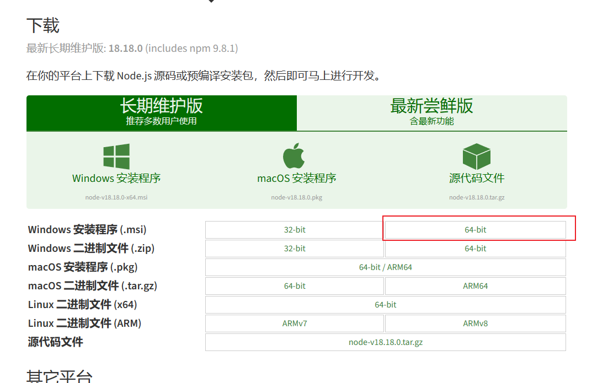
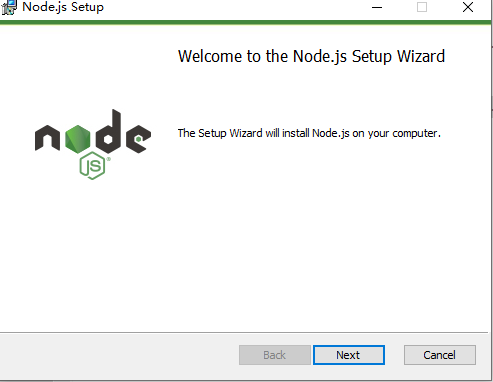
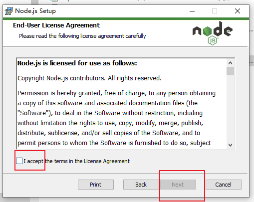
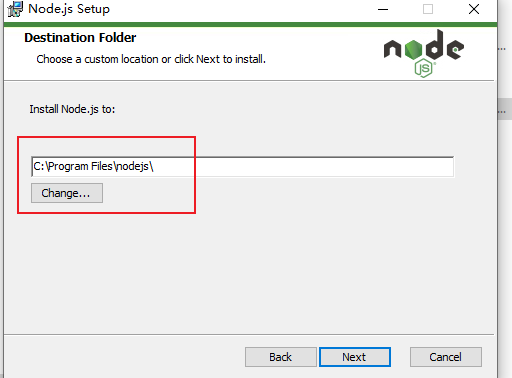

# 环境配置

> 有的网络中官网可能下载失败，可以在我分享的百度网盘下载，但是版本可能不是最新版本。
> 每年会把百度网盘的更新一次。

[百度网盘下载地址]()

## node

### 下载

[下载地址](https://nodejs.org/zh-cn/download)

下载安装包，以windows 64位为例

### 安装

1. 一路next
   
   
2. 修改存放地址
   

### 确认安装成功

## vscode

### 下载

[下载地址](https://code.visualstudio.com/Download)
